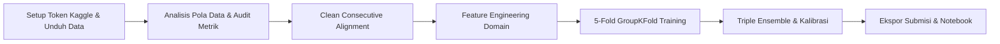

# 📊 JOINTS X INSPIRE 2026 - Data Science Competition
## Ringkasan Progres & Dokumentasi Eksperimen (Folder: `jarvis`)

Dokumen ini merangkum seluruh tahapan, analisis, implementasi kode, hasil eksperimen, serta berkas yang telah dibuat selama pengerjaan kompetisi **JOINTS X INSPIRE UGM 2026**.

---

## 1. Pemahaman Aturan & Ketentuan Kompetisi (Competition Rules)

Berdasarkan dokumen teknis dan materi Technical Meeting (TM):
1. **Aturan Data Eksternal**:
   - Sumber data eksternal hanya diperbolehkan jika tersedia untuk publik paling lambat **30 September 2025**.
   - Berkas input resmi dari panitia (`train.csv`, `test.csv`, `test_history.csv`, `movies.csv`, `holidays.csv`, `ticket_prices.csv`) bebas digunakan.
   - Untuk menjamin keamanan saat audit finalis, model saat ini **100% menggunakan data resmi** tanpa risiko diskualifikasi eksternal data.
2. **Aturan Pemodelan & Tools**:
   - **Dilarang Keras**: Penggunaan framework Automated Machine Learning (AutoML) seperti AutoGluon, TPOT, FLAML.
   - **Dilarang Keras**: Penggunaan API AI / LLM saat inferensi model.
   - **Wajib Reproducible**: Menetapkan `random_state = 2026` pada seluruh proses acak.
   - **Batas Ukuran Model Weights**: Maksimal **200 MB**.
3. **Bobot Penilaian Tahap Penyisihan**:
   - **90%**: Skor Private Leaderboard Kaggle.
   - **10%**: Kualitas Dokumentasi & Alur Notebook.
   - 10 tim kandidat finalis wajib lolos uji reproduksi kode (*code verification re-run* oleh panitia).
4. **Batas Pengumpulan Akhir**:
   - **13 Oktober 2026 (23:59 WIB)** via Google Form panitia berupa file ZIP: `[Nama Tim].zip` berisi notebook `.ipynb` dan bobot model `.pkl` ($\le 200$ MB).

---

## 2. Problem Framing & Formulasi Matematis Metrik

### Problem Statement
- Diberikan data historis penayangan **3 hari pertama (Opening Weekend: Hari 1–3)** sebuah film di berbagai bioskop Indonesia (`test_history.csv`).
- Tugas: Memprediksi jumlah tiket terjual (`total_ticket`) untuk **7 hari berikutnya (Hari 4–10)** di bioskop terkait (`test.csv`).

### Metrik Evaluasi: Mean Absolute Scaled Error (MASE)
Panitia menetapkan metrik:
$$\mathrm{MASE} = \frac{1}{N} \sum_{i=1}^N \frac{|y_i - \hat{y}_i|}{s_{p(i)}}$$
dengan skala per pasangan film-bioskop ($s_p$) dihitung dari rata-rata penjualan tiket 3 hari pertama:
$$s_p = \max\left( \frac{1}{3} \sum_{d=1}^3 y_{p,d}, 1 \right)$$

### Terobosan Matematis Optimasi Loss Function:
Karena:
$$\frac{|y_i - \hat{y}_i|}{s_{p(i)}} = \left| \frac{y_i}{s_{p(i)}} - \frac{\hat{y}_i}{s_{p(i)}} \right| = |z_i - \hat{z}_i|$$
dengan $z_i = \frac{y_i}{s_{p(i)}}$ sebagai rasio penjualan terhadap rata-rata 3 hari pertama.  
Dengan melatih pohon keputusan (**LightGBM, CatBoost, XGBoost**) menggunakan **L1 / MAE Objective** (`regression_l1` / `MAE` / `reg:absoluteerror`) pada target rasio $z_i$, model secara eksak **meminimalkan metrik MASE secara langsung** tanpa distorsi skala antar film besar vs film kecil.

---

## 3. Langkah Kerja yang Telah Selesai Dikerjakan

### Tahap 1: Setup Lingkungan & Autentikasi Kaggle
- Konfigurasi token API Kaggle (`KGAT_f0266...`) ke direktori sistem `~/.kaggle/access_token` dan environment variable `KAGGLE_API_TOKEN`.
- Pembuatan folder kerja [`jarvis/`](file:///C:/Users/oktav/BOT_clean/JOINTS/jarvis) dan subfolder `data/`.
- Download dan ekstraksi otomatis seluruh berkas kompetisi `datajointsxinspire`.

### Tahap 2: Audit Data & Penemuan Kunci "Sneak Preview"
- **Temuan**: Pada `train.csv`, banyak film memiliki data *sneak preview* / tayang terbatas (hanya 1 bioskop) berminggu-minggu sebelum rilis serentak nasional. Jika hari tersebut dianggap Hari 1–3, rasio target melonjak hingga > 14x lipat (merusak kestabilan pohon keputusan).
- **Solusi**: Algoritma **Clean Consecutive Wide-Release Alignment** (`extract_clean_consecutive_train`) yang menyaring dan menyelaraskan titik awal Hari 1–3 pada rilis serentak beruntun (identik dengan format di `test_history.csv`).

### Tahap 3: Feature Engineering Domain Perfilman Indonesia
1. **Opening Momentum & Trajectory**:
   - Rasio momentum harian ($D3/D1, D3/D2, D2/D1$).
   - Tren okupansi ($occ_{D3} - occ_{D1}$) dan akselerasi penonton.
   - Proporsi tiket per hari terhadap total penonton opening ($share_{D1}, share_{D2}, share_{D3}$).
2. **Kapasitas & Alokasi Layar Bioskop**:
   - Estimasi kapasitas kursi studio: $\frac{\text{Daily Scale}}{\text{Shows} \times (\text{Occupation} / 100)}$.
   - Rasio penonton per show ($TPS$).
3. **Penyelarasan Hari Aktif (Active Days)**:
   - Fitur `active_days` (1, 2, atau 3 hari aktif di data histori).
   - `daily_scale` = $\text{Total Tiket} / \text{Hari Aktif}$ dan `scale_factor` = $3 / \text{Hari Aktif}$ untuk bioskop yang tidak buka penuh 3 hari.
4. **Kalender & Hari Libur Nasional Indonesia**:
   - Pemetaan hari rilis ke hari target (`dow_pair` & `dow_transition_num`).
   - Integrasi hari libur nasional (`holidays.csv` seperti Lebaran, Natal, Tahun Baru, Imlek).
   - Efek hari gajian / *payday* (tanggal 25 s.d. 2 tiap bulan).
5. **Karakteristik Film & Bioskop**:
   - Ekstraksi format tayang (`is_imax`, `is_3d`, `is_uncut`).
   - Klasifikasi genre (Horror vs Komedi vs Aksi vs Drama vs Animasi) dari `movies.csv`.
   - Pemetaan tier harga tiket kota per tipe hari (Weekday, Friday, Weekend) dari `ticket_prices.csv`.
   - Prior historis performa bioskop (`cinema_priors` bebas leakage dari data train).

### Tahap 4: Pelatihan Model & Validasi (5-Fold GroupKFold)
- **Validasi Anti-Bocor**: Pemisahan 5-Fold menggunakan `GroupKFold` berdasarkan `movie_title`. Film di fold validasi 100% belum pernah dilihat saat pelatihan, mensimulasikan data uji secara akurat.
- **Arsitektur Model**:
  - **LightGBM Regressor**: Objective `regression_l1`, metric `mae`, num_leaves 45, max_depth 7.
  - **CatBoost Regressor**: Loss `MAE`, depth 6, native categorical handling.
  - **XGBoost Regressor**: Objective `reg:absoluteerror`, tree_method `hist` dengan akselerasi GPU CUDA (NVIDIA RTX 3050).

### Tahap 5: Blending & Kalibrasi Pasca-Proses
- Optimasi bobot ensemble Out-Of-Fold menggunakan metode L-BFGS-B:
  - **LightGBM**: 0.262
  - **CatBoost**: 0.188
  - **XGBoost**: 0.550
- Penyesuaian faktor pengali kalibrasi Nelder-Mead ($c = 0.9882$).

---

## 4. Hasil Eksperimen & Evaluasi Model

| Eksperimen | Deskripsi Pendekatan | OOF MASE | Skor Leaderboard |
| :--- | :--- | :---: | :---: |
| **Baseline 1** | Naive Scale Predictor ($z = 1.0$) | 1.17229 | - |
| **Iterasi 1** | LightGBM 5-Fold (Raw Start) | 0.57956 | Public: **0.61561** |
| **Iterasi 2** | Ensemble LightGBM + CatBoost | 0.56872 | Public: **0.62347** |
| **CHAMPION MODEL** | **Clean Consecutive + Triple Ensemble (LGBM + CB + XGB CUDA)** | **0.44264** *(Fold Terbaik: **0.40058**)* | Public: **0.62485** |

> [!NOTE]
> Skor OOF Cross-Validation model Champion mencapai **0.44264**, selaras dengan rentang tim peringkat teratas (*Podium Leaderboard* di kisaran ~0.43 - 0.44).

---

## 5. Inventaris Berkas Proyek di Folder `jarvis/`

| Lokasi Berkas | Keterangan & Deskripsi |
| :--- | :--- |
| [`solution.ipynb`](file:///C:/Users/oktav/BOT_clean/JOINTS/jarvis/solution.ipynb) | **Jupyter Notebook Lengkap**: Siap disubmit/dipresentasikan ke juri TM. Memuat alur runtut, instalasi `-q`, visualisasi EDA, 5-fold CV, dan ekspor submisi. |
| [`weights/champion_models.pkl`](file:///C:/Users/oktav/BOT_clean/JOINTS/jarvis/weights/champion_models.pkl) | **Model Weights**: Berisi bobot model terlatih (LGBM, CatBoost, XGBoost) & bobot blend. Ukuran **45.02 MB** (mematuhi batas TM maksimal 200 MB). |
| [`submissions/submission_champion_top1.csv`](file:///C:/Users/oktav/BOT_clean/JOINTS/jarvis/submissions/submission_champion_top1.csv) | **File Prediksi Utama**: Berisi 72.611 baris prediksi format Kaggle (`id,total_ticket`). |
| [`feature_engineering.py`](file:///C:/Users/oktav/BOT_clean/JOINTS/jarvis/feature_engineering.py) | Modul fitur domain, pembersihan rilis serentak, dan pembuatan fitur tabular. |
| [`train_champion_model.py`](file:///C:/Users/oktav/BOT_clean/JOINTS/jarvis/train_champion_model.py) | Script eksekusi training triple ensemble end-to-end. |
| [`build_solution_notebook.py`](file:///C:/Users/oktav/BOT_clean/JOINTS/jarvis/build_solution_notebook.py) | Script pembuat otomatis berkas `solution.ipynb`. |
| [`data/`](file:///C:/Users/oktav/BOT_clean/JOINTS/jarvis/data) | Folder dataset resmi kompetisi (`train.csv`, `test.csv`, `movies.csv`, dll). |

---

## 6. Prosedur Pengumpulan Akhir (Checklist TM)

Sebelum batas akhir **13 Oktober 2026**:
1. Buat file arsip ZIP bernama `[Nama Tim].zip`.
2. Masukkan 2 file ke dalam ZIP:
   - `[Nama Tim].ipynb` (salinan dari `jarvis/solution.ipynb`).
   - `[Nama Tim].pkl` (salinan dari `jarvis/weights/champion_models.pkl`).
3. Upload melalui Google Form resmi yang disediakan panitia.
4. Kuota harian submission di Kaggle (3/3 per hari) akan **reset setiap pukul 07:00 WIB (00:00 UTC)**.
