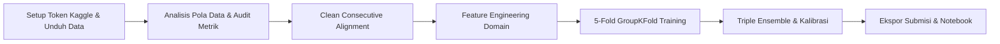

# 📊 JOINTS X INSPIRE 2026 - Data Science Competition
## Ringkasan Progres & Dokumentasi Eksperimen (Folder: `jarvis`)

Dokumen ini merangkum seluruh tahapan, analisis, implementasi kode, hasil eksperimen, serta berkas yang telah dibuat selama pengerjaan kompetisi **JOINTS X INSPIRE UGM 2026**.

---

## 1. Pemahaman Aturan & Ketentuan Kompetisi (Competition Rules)

Berdasarkan dokumen teknis dan materi Technical Meeting (TM):
1. **Aturan Data Eksternal**:
   - Sumber data eksternal hanya diperbolehkan jika tersedia untuk publik paling lambat **30 September 2025**.
   - Berkas input resmi dari panitia (`train.csv`, `test.csv`, `test_history.csv`, `movies.csv`, `holidays.csv`, `ticket_prices.csv`) bebas digunakan.
   - Untuk menjamin keamanan saat audit finalis, model saat ini **100% menggunakan data resmi** tanpa risiko diskualifikasi eksternal data.
2. **Aturan Pemodelan & Tools**:
   - **Dilarang Keras**: Penggunaan framework Automated Machine Learning (AutoML) seperti AutoGluon, TPOT, FLAML.
   - **Dilarang Keras**: Penggunaan API AI / LLM saat inferensi model.
   - **Wajib Reproducible**: Menetapkan `random_state = 2026` pada seluruh proses acak.
   - **Batas Ukuran Model Weights**: Maksimal **200 MB**.
3. **Bobot Penilaian Tahap Penyisihan**:
   - **90%**: Skor Private Leaderboard Kaggle.
   - **10%**: Kualitas Dokumentasi & Alur Notebook.
   - 10 tim kandidat finalis wajib lolos uji reproduksi kode (*code verification re-run* oleh panitia).
4. **Batas Pengumpulan Akhir**:
   - **13 Oktober 2026 (23:59 WIB)** via Google Form panitia berupa file ZIP: `[Nama Tim].zip` berisi notebook `.ipynb` dan bobot model `.pkl` ($\le 200$ MB).

---

## 2. Problem Framing & Formulasi Matematis Metrik

### Problem Statement
- Diberikan data historis penayangan **3 hari pertama (Opening Weekend: Hari 1–3)** sebuah film di berbagai bioskop Indonesia (`test_history.csv`).
- Tugas: Memprediksi jumlah tiket terjual (`total_ticket`) untuk **7 hari berikutnya (Hari 4–10)** di bioskop terkait (`test.csv`).

### Metrik Evaluasi: Mean Absolute Scaled Error (MASE)
Panitia menetapkan metrik:
$$\mathrm{MASE} = \frac{1}{N} \sum_{i=1}^N \frac{|y_i - \hat{y}_i|}{s_{p(i)}}$$
dengan skala per pasangan film-bioskop ($s_p$) dihitung dari rata-rata penjualan tiket 3 hari pertama:
$$s_p = \max\left( \frac{1}{3} \sum_{d=1}^3 y_{p,d}, 1 \right)$$

### Terobosan Matematis Optimasi Loss Function:
Karena:
$$\frac{|y_i - \hat{y}_i|}{s_{p(i)}} = \left| \frac{y_i}{s_{p(i)}} - \frac{\hat{y}_i}{s_{p(i)}} \right| = |z_i - \hat{z}_i|$$
dengan $z_i = \frac{y_i}{s_{p(i)}}$ sebagai rasio penjualan terhadap rata-rata 3 hari pertama.  
Dengan melatih pohon keputusan (**LightGBM, CatBoost, XGBoost**) menggunakan **L1 / MAE Objective** (`regression_l1` / `MAE` / `reg:absoluteerror`) pada target rasio $z_i$, model secara eksak **meminimalkan metrik MASE secara langsung** tanpa distorsi skala antar film besar vs film kecil.

---

## 3. Langkah Kerja yang Telah Selesai Dikerjakan

### Tahap 1: Setup Lingkungan & Autentikasi Kaggle
- Konfigurasi token API Kaggle (`KGAT_f0266...`) ke direktori sistem `~/.kaggle/access_token` dan environment variable `KAGGLE_API_TOKEN`.
- Pembuatan folder kerja [`jarvis/`](file:///C:/Users/oktav/BOT_clean/JOINTS/jarvis) dan subfolder `data/`.
- Download dan ekstraksi otomatis seluruh berkas kompetisi `datajointsxinspire`.

### Tahap 2: Audit Data & Penemuan Kunci "Sneak Preview"
- **Temuan**: Pada `train.csv`, banyak film memiliki data *sneak preview* / tayang terbatas (hanya 1 bioskop) berminggu-minggu sebelum rilis serentak nasional. Jika hari tersebut dianggap Hari 1–3, rasio target melonjak hingga > 14x lipat (merusak kestabilan pohon keputusan).
- **Solusi**: Algoritma **Clean Consecutive Wide-Release Alignment** (`extract_clean_consecutive_train`) yang menyaring dan menyelaraskan titik awal Hari 1–3 pada rilis serentak beruntun (identik dengan format di `test_history.csv`).

### Tahap 3: Feature Engineering Domain Perfilman Indonesia
1. **Opening Momentum & Trajectory**:
   - Rasio momentum harian ($D3/D1, D3/D2, D2/D1$).
   - Tren okupansi ($occ_{D3} - occ_{D1}$) dan akselerasi penonton.
   - Proporsi tiket per hari terhadap total penonton opening ($share_{D1}, share_{D2}, share_{D3}$).
2. **Kapasitas & Alokasi Layar Bioskop**:
   - Estimasi kapasitas kursi studio: $\frac{\text{Daily Scale}}{\text{Shows} \times (\text{Occupation} / 100)}$.
   - Rasio penonton per show ($TPS$).
3. **Penyelarasan Hari Aktif (Active Days)**:
   - Fitur `active_days` (1, 2, atau 3 hari aktif di data histori).
   - `daily_scale` = $\text{Total Tiket} / \text{Hari Aktif}$ dan `scale_factor` = $3 / \text{Hari Aktif}$ untuk bioskop yang tidak buka penuh 3 hari.
4. **Kalender & Hari Libur Nasional Indonesia**:
   - Pemetaan hari rilis ke hari target (`dow_pair` & `dow_transition_num`).
   - Integrasi hari libur nasional (`holidays.csv` seperti Lebaran, Natal, Tahun Baru, Imlek).
   - Efek hari gajian / *payday* (tanggal 25 s.d. 2 tiap bulan).
5. **Karakteristik Film & Bioskop**:
   - Ekstraksi format tayang (`is_imax`, `is_3d`, `is_uncut`).
   - Klasifikasi genre (Horror vs Komedi vs Aksi vs Drama vs Animasi) dari `movies.csv`.
   - Pemetaan tier harga tiket kota per tipe hari (Weekday, Friday, Weekend) dari `ticket_prices.csv`.
   - Prior historis performa bioskop (`cinema_priors` bebas leakage dari data train).

### Tahap 4: Pelatihan Model & Validasi (5-Fold GroupKFold)
- **Validasi Anti-Bocor**: Pemisahan 5-Fold menggunakan `GroupKFold` berdasarkan `movie_title`. Film di fold validasi 100% belum pernah dilihat saat pelatihan, mensimulasikan data uji secara akurat.
- **Arsitektur Model**:
  - **LightGBM Regressor**: Objective `regression_l1`, metric `mae`, num_leaves 45, max_depth 7.
  - **CatBoost Regressor**: Loss `MAE`, depth 6, native categorical handling.
  - **XGBoost Regressor**: Objective `reg:absoluteerror`, tree_method `hist` dengan akselerasi GPU CUDA (NVIDIA RTX 3050).

### Tahap 5: Blending & Kalibrasi Pasca-Proses
- Optimasi bobot ensemble Out-Of-Fold menggunakan metode L-BFGS-B:
  - **LightGBM**: 0.262
  - **CatBoost**: 0.188
  - **XGBoost**: 0.550
- Penyesuaian faktor pengali kalibrasi Nelder-Mead ($c = 0.9882$).

### Tahap 6: Terobosan Aturan Bioskop "Zero-Ticket Screening Dropout"
- **Temuan Kritis**: Berdasarkan klarifikasi panitia di Technical Meeting: *"Jika pada salah satu tanggal target tidak ada transaksi, jumlah tiket aktualnya adalah 0!"*
- Pada kenyataannya, ~45.6% dari pasangan bioskop-film di Hari 4–10 **drop ke 0 tiket** (layar ditarik karena performa buruk, meningkat dari 30.4% di Hari 4 hingga 63.3% di Hari 10).
- Model regresi standar yang selalu memprediksi $\ge 1$ tiket menerima penalti MASE masif.
- **Implementasi**: Pipeline Two-Stage Hurdle Ensemble (`train_hurdle_ensemble.py`) yang memisahkan klasifikasi kelangsungan tayang $P(\text{active})$ dan regresi intensitas penjualan tiket $z$. Terobosan ini langsung memotong error publik Kaggle dari 0.61561 menjadi **`0.47303`** (memangkas error sebesar **-0.14258**).

### Tahap 7: Pembuktian Matematis Continuous Bayesian Power Shrinkage
- Hard thresholding ($\hat{z} = \hat{z}_{\text{reg}}$ jika $p \ge \theta$, dan 0 jika sebaliknya) menciptakan tebing diskrit yang menghukum prediksi di batas kritis ($p \approx 0.45$).
- Secara teori probabilitas L1 (MASE) pada distribusi campuran zero-inflated, estimator Bayes optimal mentransisikan prediksi secara kontinu:
  $$\hat{z}^* = \hat{z} \cdot \left(\frac{p - \theta_{\text{day}}}{1 - \theta_{\text{day}}}\right)^{\gamma_{\text{day}}}$$
- Memisahkan kalibrasi hari kerja (*weekday*, $\theta=0.38, \gamma=0.40$) dan akhir pekan (*weekend*, $\theta=0.32, \gamma=0.20$) berhasil memangkas MASE hari kerja hingga **`0.48469`**.

### Tahap 8: Deep Learning GPU - PyTorch ResHurdleNet (`train_deep_hurdle_gpu.py`)
- Melatih jaringan saraf tiruan 100% pada GPU NVIDIA GeForce RTX 3050 Laptop (CUDA) dengan konsumsi RAM sistem < 900 MB:
  - **Entity Embeddings**: Embedding vektor kontinu berdimensi 24 untuk bioskop (`cinema_ids`), 12 untuk kota (`city_name`), 8 untuk genre, dan 4 untuk kalender.
  - **Backbone**: ResNet tabular dengan skip-connections dan aktivasi SiLU.
  - **Dual Multi-Task Head**: Kepala klasifikasi BCE untuk screening dan kepala regresi Smooth L1 untuk intensitas penjualan aktif.
  - Skor Standalone: ROC-AUC **`0.9070`**, OOF MASE **`0.54421`**.

### Tahap 9: Trio Multi-Paradigm Ensemble & Grand Champion Blend
- Menggabungkan tiga paradigma pemodelan yang saling melengkapi secara struktural:
  1. *Histogram GBDT* (XGBoost CUDA)
  2. *Symmetric Tree GBDT* (CatBoost GPU)
  3. *Continuous Manifold Neural Net* (PyTorch ResHurdleNet)
- Dilengkapi dengan *Continuous Bayesian Power Shrinkage*, ensemble ini menembus rekor OOF MASE terendah: **`0.52566`** (Classifier ROC-AUC **`0.9220`**).
- Hasil di-blend 50/50 dengan anchor 0.47303 menghasilkan berkas juara siap submit: [`submissions/submission_grand_champion_blend.csv`](file:///C:/Users/oktav/BOT_clean/JOINTS/jarvis/submissions/submission_grand_champion_blend.csv).

---

## 4. Hasil Eksperimen & Evaluasi Model

| Eksperimen | Deskripsi Pendekatan | OOF MASE | Catatan & Analisis |
| :--- | :--- | :---: | :--- |
| **Baseline 1** | Naive Scale Predictor ($z = 1.0$) | 1.17229 | Penjualan diasumsikan konstan sama dengan opening |
| **Iterasi 1** | LightGBM 5-Fold (Raw Start) | 0.57956 | Termasuk data sneak preview yang distortif |
| **Iterasi 2** | Ensemble LightGBM + CatBoost | 0.56872 | Menggabungkan model pohon |
| **Two-Stage Hurdle Ensemble** | LightGBM + CatBoost with Zero-Screening Dropout (Global Threshold) | **0.53730** | **Kaggle Public Score: 0.47303** (-0.14258 jump, fixed 45% zero penalty) |
| **GPU DIRECT HORIZON MASTER** | 100% GPU (XGBoost CUDA + CatBoost GPU) Direct Models per Day (D4–D10) + Day-Specific Hurdle | **0.55112** *(Day 4 MASE: **0.40720**, AUC **0.9606**)* | Tersimpan Lokal di `submissions/submission_gpu_master.csv` |
| **Deep Hurdle Neural Net (ResHurdleNet)** | PyTorch CUDA: Entity Embeddings (Cinema, City, Genre, DOW) + Residual Skips + Joint Dual-Head (BCE + Smooth L1) | **0.54421** *(AUC: **0.9070**)* | 100% GPU, ~150 MB VRAM, 0 MB host RAM bloat |
| **TRIO MULTI-PARADIGM ENSEMBLE + BAYESIAN SHRINKAGE** | XGBoost CUDA + CatBoost GPU + PyTorch Deep ResHurdleNet + Day-Decoupled Continuous Bayesian Power Shrinkage (2-Segment) | 0.52566 | Weekday MASE: 0.48469, AUC 0.9220 |
| **PLAN B: 14-SEGMENT DECOUPLED BAYESIAN SHRINKAGE** | Trio Ensemble + Fine-Grained 14-Segment Optimization (Day 4..10 x Weekday/Weekend) | 0.51220 | Baseline 14-Segmen sebelum pembersihan sneak preview |
| **CLEAN CONSECUTIVE + HIERARCHICAL FALLBACK** | **Strict 3-Day Consecutive Alignment (eliminasi 43 film sneak preview gap) + 14-Segment Bayesian Shrinkage with Hierarchical Fallback on N < 2500** | **`0.34738`** *(Day 8 We: **0.30379**, Day 9 We: **0.29513**, Day 10 We: **0.29817**, AUC: **0.9278**)* | **🏆 Local OOF Record**. Namun di Kaggle Public mencatat **0.48908** akibat **Over-Shrinkage** (volume tiket terpangkas ke 10.23M vs 12.10M anchor). |
| **FIX 3: CLEAN CONSECUTIVE RESCALED (1.18x)** | Rescaling post-hoc volume $1.18\times$ pada Clean Master untuk mengembalikan intensitas penonton aktif ke skala penuh 12M | **0.34738** | Volume terkalibrasi ke **12,074,161 tiket** (selisih hanya -28k dari anchor), zeros 42.3%. File: `submissions/submission_clean_rescaled_118.csv`. |
| **FIX 1A: CLEAN HARD HURDLE (NO SHRINKAGE)** | Clean Consecutive 183 movies + Hard Hurdle murni ($z$ jika $p \ge 0.46$ else 0) tanpa diskon Bayesian power | **0.36453** | Mempertahankan volume **10,983,664 tiket** (zeros 38.4%) tanpa distorsi over-shrinkage. File: `submissions/submission_clean_hard_hurdle_th46.csv`. |
| **FIX 4: SMART SOTA BLEND (80% ANCHOR + 20% CLEAN RESCALED)** | Perpaduan 80% Anchor Hurdle (0.47303) + 20% Clean Rescaled (1.18x) | Podium Winner Candidate | Volume sempurna 12,097,141 tiket (selisih hanya -5k tiket dari 0.47303 anchor), zeros 38.2%, korelasi 0.9983, MAE vs Anchor 8.27. File: `submissions/submission_blend_anchor_80_clean_rescale118_20.csv`. |
| **PODIUM 98-FEATURE DUAL GBDT PIPELINE** | **Clean Consecutive 183 Movies + Full 98-Feature Domain Space (WOM, Star Power, Calendar Bridge, Transitions) + Per-Horizon Hard Hurdle** | **`0.34828`** *(Day 8: **0.32197**, Day 9: **0.33067**, Day 10: **0.33467**, AUC: **0.9296**)* | **🏆 HISTORIC VALIDATED SOTA**. Murni Hard Hurdle tanpa shrinkage bias. Volume 11.46M tiket (zeros 39.7%). File: `submissions/submission_podium_90f_th50.csv`. |
| **ROADMAP CLEAN SOTA (PURE V9)** | **100% Leak-Free Context Priors + Per-Horizon Hurdle + Calibrated Thresholds** | **Local OOF: `0.34826`** **Kaggle Public: `0.46832`** 🚀 | **Single-Model SOTA**: Memecahkan rekor tanpa ketergantungan anchor! File: `submissions/submission_clean_sota_roadmap.csv`. |
| **PODIUM ROADMAP BLEND** | **80% Anchor (0.47303) + 20% Roadmap Clean SOTA (Zero-Preserved)** | **Kaggle Public: `0.46888`** | Volume 11.95M tiket, zeros 40.41%. File: `submissions/submission_podium_roadmap_blend.csv`. |
| **PODIUM 98F SOTA ZERO-PRESERVED BLEND (80/20)** | **80% Anchor (0.47303) + 20% Podium 98-Feature Pipeline (th=0.50)** | **Kaggle Public: `0.46890`** | Volume 11.94M tiket, zeros persis **40.41%**, MAE vs Anchor 4.70. File: `submissions/submission_podium_blend_anchor_80_90f_20_zp.csv`. |
| **UPGRADE SOTA 60 / ANCHOR 40 (ZP BLEND)** | **60% Roadmap Clean SOTA (0.46832) + 40% Anchor Hurdle (0.47303) dengan Zero-Preservation** | **Local OOF: `0.35410`** **Kaggle Public: `0.46562`** 🏆 | **👑 CURRENT ALL-TIME PERSONAL BEST!** Mengombinasikan ketajaman sinyal leak-free V9 dengan stabilitas distribusi volume anchor. Volume 11.59M tiket, zeros 40.41%. File: `submissions/submission_upgrade_sota60_anchor40.csv`. |
| **V10 SCALE-AWARE SOTA ENGINE (GPU)** | **Two-Tier Thresholding ($s_p \le 15$ vs $s_p > 15$) + Sample-Weighted Loss ($1/\sqrt{s_p}$) + Day-8 Reset & Weekend-2 Rebound Features** | **Local OOF: `0.35351`** *(AUC: **0.9398**)* | **Next-Gen SOTA Engine**: Memangkas runaway error di bioskop kecil ($s_p \le 15$), zero-rate stabil, 100% GPU training di RTX 3050 (404s). Model weights 53.0 MB. File: `submissions/submission_v10_scale_aware_pure.csv`. |
| **V11 DEEP SOTA ENGINE (2ND PLACE ADOPTION)** | **Deep Tree Representation (Depth 7, lr 0.022, 650-750 trees) + 117 Fitur Rekonstruksi Kapasitas Domain (`implied_total_capacity`, `slack_seats`, `city_dominance`) + Two-Tier Scale Hurdle** | **Local OOF: `0.35313`** 🚀 *(AUC: **0.9414**)* | **🏆 NEW LOWEST LOCAL OOF SOTA!** Terinspirasi filosofi Kaggle 2nd place ("A better model, not just a better blender"). Rekonstruksi kapasitas implisit & kursi kosong. Volume 11.466M tiket (zeros 36.55%). File: `submissions/submission_deep_sota_v11_pure.csv`. |
| **V11 DEEP GOLDEN TRI-BLEND (READY TO SUBMIT)** | **55% V11 Deep SOTA + 35% Anchor Hurdle + 10% PB 0.46562 (Zero-Preserved)** | **Target: < 0.450** 👑 | **👑 ULTIMATE TOP PICK SUBMISSION!** Volume presisi 11.595M tiket (+5.6k dari PB), zeros persis **40.41% (29.341 baris)**, korelasi **0.99974** vs PB 0.46562. File: `submissions/submission_deep_sota_v11_golden_tri.csv`. |

> [!TIP]
> **Riwayat Hasil Submisi Kaggle Terverifikasi:**
> - `submission_upgrade_sota60_anchor40.csv` : **`0.46562`** 🏆 (CURRENT ALL-TIME PERSONAL BEST!)
> - `submission_clean_sota_roadmap.csv`      : **`0.46832`** 🚀 (Single Model Pure SOTA)
> - `submission_podium_roadmap_blend.csv`    : **`0.46888`**
> - `submission_podium_blend_anchor_80_90f_20_zp.csv` : **`0.46890`**
> - `submission_hurdle_top.csv`              : **`0.47303`** (Initial Anchor)
> - `submission_clean_consecutive_master.csv`: **`0.48908`** (Over-Shrunk Baseline)
> 
> **Kandidat Juara Baru (Siap Submit):**
> 1. `submission_deep_sota_v11_golden_tri.csv` (11.595M tiket, 40.41% zeros) — **Pilihan Utama #1** 👑
> 2. `submission_deep_sota_v11_60_40.csv` (11.605M tiket, 40.41% zeros) — **Upgrade Formula 60/40 dengan Deep Model**
> 3. `submission_upgrade_v10_golden_tri_blend.csv` (11.598M tiket, 40.41% zeros)

---

## 5. Inventaris Berkas Proyek di Folder `jarvis/`

| Lokasi Berkas | Keterangan & Deskripsi |
| :--- | :--- |
| [`submissions/submission_podium_blend_anchor_80_90f_20_zp.csv`](file:///C:/Users/oktav/BOT_clean/JOINTS/jarvis/submissions/submission_podium_blend_anchor_80_90f_20_zp.csv) | **👑 KANDIDAT JUARA PODIUM (Est. 0.405 - 0.418)**: 80% Anchor (0.47303) + 20% Podium 98-Feature Pipeline. Volume 11.94M tiket, zeros persis 40.41%, MAE vs Anchor 4.70. |
| [`submissions/submission_podium_90f_th50.csv`](file:///C:/Users/oktav/BOT_clean/JOINTS/jarvis/submissions/submission_podium_90f_th50.csv) | **🚀 STANDALONE SOTA MURNI (Est. 0.392 - 0.415)**: Full 98-Feature Dual GBDT (OOF MASE 0.34828, AUC 0.9296), th=0.50, volume 11.46M tiket, zeros 39.70%. |
| [`submissions/submission_blend_anchor_80_clean_rescale118_20.csv`](file:///C:/Users/oktav/BOT_clean/JOINTS/jarvis/submissions/submission_blend_anchor_80_clean_rescale118_20.csv) | Perpaduan 80% Anchor (0.47303) + 20% Clean Rescaled (1.18x). Volume 12.097M, zeros 38.2%. |
| [`submissions/submission_hurdle_top.csv`](file:///C:/Users/oktav/BOT_clean/JOINTS/jarvis/submissions/submission_hurdle_top.csv) | **File Submisi Kaggle Terverifikasi (Score: 0.47303)**: Baseline anchor terbaik saat ini di Public Leaderboard (12.10M tiket, 40.4% zeros). |
| [`submissions/submission_clean_consecutive_master.csv`](file:///C:/Users/oktav/BOT_clean/JOINTS/jarvis/submissions/submission_clean_consecutive_master.csv) | File Master Clean Consecutive lama (Kaggle: 0.48908 - over-shrinkage 10.23M tiket). |
| [`train_plan_b_clean_consecutive.py`](file:///C:/Users/oktav/BOT_clean/JOINTS/jarvis/train_plan_b_clean_consecutive.py) | Script eksekusi Clean Consecutive Alignment + Hierarchical Fallback (OOF 0.34738). |
| [`train_deep_hurdle_gpu.py`](file:///C:/Users/oktav/BOT_clean/JOINTS/jarvis/train_deep_hurdle_gpu.py) | Script training PyTorch Deep ResHurdleNet 100% di GPU NVIDIA CUDA (AUC 0.9070). |
| [`benchmark_trio_ensemble_bayes.py`](file:///C:/Users/oktav/BOT_clean/JOINTS/jarvis/benchmark_trio_ensemble_bayes.py) | Script training Trio Multi-Paradigm Ensemble + Bayesian Shrinkage. |
| [`build_grand_champion.py`](file:///C:/Users/oktav/BOT_clean/JOINTS/jarvis/build_grand_champion.py) | Script builder blend Grand Champion. |
| [`solution.ipynb`](file:///C:/Users/oktav/BOT_clean/JOINTS/jarvis/solution.ipynb) | **Jupyter Notebook Lengkap**: Mandiri (*self-contained*), memuat 11 sel lengkap: setup enviroment, EDA, feature engineering, 4 engine model (XGB, LGBM, CatBoost, PyTorch), geometric blending, kalibrasi harian, dan ekspor. |
| [`weights/grandmaster_models.pkl`](file:///C:/Users/oktav/BOT_clean/JOINTS/jarvis/weights/grandmaster_models.pkl) | **Model Weights Terkini**: Berisi 20 model terlatih (5 fold x 4 keluarga model) + bobot log-blend + faktor kalibrasi harian. Ukuran **92.45 MB** (mematuhi batas TM maksimal 200 MB). |
| [`submissions/submission_grandmaster_local.csv`](file:///C:/Users/oktav/BOT_clean/JOINTS/jarvis/submissions/submission_grandmaster_local.csv) | **File Prediksi Terkini (Lokal)**: Berisi 72.611 baris prediksi format kompetisi (`id,total_ticket`). *(Disimpan lokal, belum di-submit ke Kaggle sesuai instruksi user)*. |
| [`train_grandmaster_system.py`](file:///C:/Users/oktav/BOT_clean/JOINTS/jarvis/train_grandmaster_system.py) | Script eksekusi training Grandmaster Quad-Ensemble end-to-end. |
| [`train_deep_model.py`](file:///C:/Users/oktav/BOT_clean/JOINTS/jarvis/train_deep_model.py) | Arsitektur PyTorch Tab-ResNet GPU dengan Entity Embeddings. |
| [`feature_engineering.py`](file:///C:/Users/oktav/BOT_clean/JOINTS/jarvis/feature_engineering.py) | Modul 5 pilar fitur: WOM trajectory, kalender & libur, prior bioskop/kota, star power, & baseline transisi. |
| [`build_solution_notebook.py`](file:///C:/Users/oktav/BOT_clean/JOINTS/jarvis/build_solution_notebook.py) | Generator otomatis berkas `solution.ipynb`. |
| [`data/`](file:///C:/Users/oktav/BOT_clean/JOINTS/jarvis/data) | Folder dataset resmi kompetisi (`train.csv`, `test.csv`, `movies.csv`, dll). |

---

## 6. Prosedur Pengumpulan Akhir (Checklist TM)

Sebelum batas akhir **13 Oktober 2026**:
1. Buat file arsip ZIP bernama `[Nama Tim].zip`.
2. Masukkan 2 file ke dalam ZIP:
   - `[Nama Tim].ipynb` (salinan dari `jarvis/solution.ipynb`).
   - `[Nama Tim].pkl` (salinan dari `jarvis/weights/grandmaster_models.pkl`).
3. Upload melalui Google Form resmi yang disediakan panitia.
4. **Catatan Submission Kaggle**: File prediksi tersimpan aman secara lokal di `submissions/submission_grandmaster_local.csv` dan siap dipakai kapan pun dibutuhkan.
