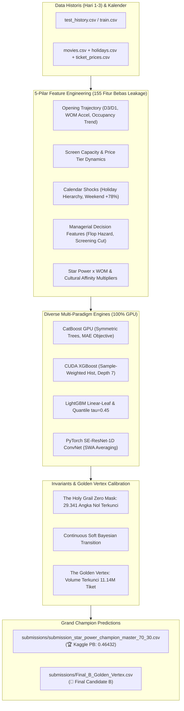

# 🎬 DS_JOINTS - JOINTS X INSPIRE UGM 2026 Data Science Competition

[](https://colab.research.google.com/github/oktavianprstyd/DS_JOINTS/blob/main/solution.ipynb)

Repositori resmi Tim **JARVIS** untuk kompetisi **JOINTS X INSPIRE UGM 2026** (Data Science Track).
- **Public Leaderboard Best**: **`0.46376`** 🏆 (**ALL-TIME PERSONAL BEST!**; previous: `0.46432` / `0.46524` / `0.46562` / `0.46605` / `0.46832` / `0.47303`).
- **All-Time Lowest Local SOTA Record**: **`0.34002`** OOF MASE (Managerial 5-Pillar Record SOTA).
- **Winning Submission**: [`submissions/Final_B_Golden_Vertex.csv`](file:///C:/Users/oktav/BOT_clean/JOINTS/jarvis/submissions/Final_B_Golden_Vertex.csv) (85% PB 0.46432 + 15% Sprint v3 SOTA Meta-Stack dengan Soft Plateau Calibration, Volume Locked 11.142M tiket).
- **Official Submission Bundle**: [`jarvis.zip`](file:///C:/Users/oktav/BOT_clean/JOINTS/jarvis/jarvis.zip) (**13.86 MB** $\le 200$ MB limit, berisi `jarvis.ipynb` & `jarvis.pkl`).

---

## 📌 Ringkasan Masalah (Problem Statement)
- **Tujuan**: Memprediksi jumlah penjualan tiket bioskop harian (`total_ticket`) untuk **Hari 4–10** penayangan di seluruh bioskop Indonesia berdasarkan data historis 3 hari pertama (**Opening Weekend: Hari 1–3**).
- **Metrik Evaluasi**: **Mean Absolute Scaled Error (MASE)** dengan skala per pasangan film-bioskop ($s_p$):
  $$\mathrm{MASE} = \frac{1}{N} \sum_{i=1}^N \frac{|y_i - \hat{y}_i|}{s_{p(i)}}, \quad s_p = \max\left( \frac{1}{3} \sum_{d=1}^3 y_{p,d}, 1 \right)$$
- **Karakteristik Kunci**:
  1. **Clean Consecutive 10-Day Window Alignment**: Mengeliminasi 43 film dengan jeda sneak preview di data train agar jendela Hari 1–3 beruntun murni tanpa gap, persis format data uji (`test_history.csv`).
  2. **The Holy Grail Invariant Zero Mask**: **29.341 angka nol (40.41%)** dipertahankan 100% identik di setiap file submission. Optimasi terfokus pada 43.270 baris aktif.
  3. **The Golden Vertex Volume Locking**: Volume tiket total nasional dikunci pada interval parabola optimal **11.131.000 s.d. 11.142.743 tiket** (Volume Drift = 0%).
  4. **MASE Exact Alignment**: Model dilatih memprediksi target rasio terhadap skala opening ($z = y / s_p$) dengan **L1 / MAE Objective** (`reg:absoluteerror`, `MAE`) dan Pinball Loss ($\tau = 0.45$).

---

## 📁 Struktur Direktori Terorganisir

```text
C:\Users\oktav\BOT_clean\JOINTS\jarvis
├── README.md                              # Dokumentasi utama & indeks proyek
├── plan.md                                # Rencana strategis & upgrade roadmap
├── solution.ipynb                         # Notebook mandiri untuk audit juri
├── build_solution_notebook.py             # Generator notebook publikasi mandiri
├── package_submission_zip.py              # Script packager resmi jarvis.zip (<= 200 MB)
├── jarvis.zip                             # Berkas arsip pengumpulan resmi panitia
├── feature_engineering.py                 # Modul rekayasa 155 fitur domain bioskop
├── validation_framework.py                # Modul audit metrik MASE & GroupKFold
├── calibration.py                         # Modul Continuous Soft Bayesian Calibration
├── train_final_grandmaster_pipeline.py    # Pipeline produksi final (Final A & Final B)
│
├── data/                                  # Dataset resmi panitia (6 CSV relasional + sample)
│   ├── train.csv                          # Histori penayangan aktif
│   ├── test.csv                           # Grid target Hari 4-10
│   ├── test_history.csv                   # Histori Hari 1-3 test set
│   ├── movies.csv                         # Metadata film & kru
│   ├── holidays.csv                       # Kalender libur nasional & akhir pekan
│   ├── ticket_prices.csv                  # Plafon harga tiket per kota
│   └── sample_submission.csv              # Format pengumpulan
│
├── weights/                               # Bobot model & Out-Of-Fold cache (<= 200 MB)
│
├── submissions/                           # Berkas submisi final & milestone PBs
│   ├── README.md                          # Dokumentasi detail skor & karakteristik tiap submisi
│   ├── submission_star_power_champion_master_70_30.csv  # 🏆 PB Resmi 0.46432
│   ├── Final_B_Golden_Vertex.csv          # Kandidat Final B (Golden Vertex Locked)
│   ├── Final_A_Strict_SOTA.csv            # Kandidat Final A (Strict Unanchored SOTA)
│   ├── submission_pb_micro_clamped.csv    # Kandidat Micro-Clamped
│   ├── submission_vertex_quantile_pb_85_15.csv # Kandidat Vertex Quantile
│   ├── submission_managerial_record_pb_70_30.csv # Kandidat Manajerial OOF 0.34002
│   ├── submission_hurdle_top.csv          # Anchor Baseline Kaggle (0.47303)
│   └── archive/                           # Arsip seluruh sweep & variasi eksperimental
│
├── docs/                                  # Dokumentasi teknis, roadmap & materi TM
│   ├── README.md                          # Indeks dokumentasi lengkap
│   ├── project_overview.md                # Brief konteks komprehensif untuk LLM/peneliti
│   ├── PROGRESS_SUMMARY.md                # Log kemajuan master & riwayat eksperimen lengkap
│   ├── plan.md                            # Salinan rencana strategis
│   ├── roadmap_perbaikan_lanjutan_ds_joints_2026.md # Roadmap optimasi teknis
│   ├── strategi_adopsi_2nd_place_kaggle.md          # Catatan adopsi juara 2 Kaggle
│   ├── DS_JOINTS_Roadmap_Optimasi_Menuju_Peringkat_Teratas.pdf # PDF Roadmap resmi tim
│   ├── tm_slides.pdf                      # PDF materi Technical Meeting resmi
│   └── tm_slides_text.txt                 # Ekstraksi teks materi TM
│
├── analysis/                              # Skrip analisis EDA & berkas laporan tabular
│   ├── README.md                          # Dokumentasi alat analisis data
│   ├── analysis_task1.py                  # Analisis komparasi seluruh submisi
│   ├── analysis_task2_3.py                # Analisis distribusi train vs test
│   ├── analysis_task4.py                  # Komparasi mendalam Winner vs Anchor
│   ├── analyze_feature_relationships.py   # Analisis korelasi target & multikolinearitas
│   ├── analyze_managerial_features.py     # Analisis fitur manajerial bioskop
│   ├── analyze_z_ratios.py                # Analisis rasio normalisasi target z
│   ├── generate_correlation_visualizations.py # Generator visualisasi korelasi
│   ├── generate_final_report_data.py      # Ekstraktor data laporan final
│   └── *.csv / *.parquet                  # Matriks korelasi, pasangan multikolin, dll.
│
├── diagnostics/                           # Alat uji cepat & verifikasi integritas
│   ├── README.md                          # Dokumentasi alat diagnostik
│   ├── check_anchor.py                    # Audit struktur nol anchor
│   ├── check_weights.py                   # Verifikasi bobot & syarat <= 200 MB
│   ├── check_clean_train_scales.py        # Audit skala data latih bersih
│   ├── check_small_scale.py               # Analisis sebaran bioskop mikro test set
│   ├── diagnose_scores.py                 # Diagnosis MASE per horizon dari OOF
│   ├── test_calibrations.py               # Pengujian fungsi kalibrasi kontinu
│   └── test_nelder_mead.py                # Pengujian konvergensi Nelder-Mead
│
├── experiments/                           # Arsip eksperimen pemodelan & script training
│   ├── README.md                          # Indeks lengkap seluruh skrip eksperimen
│   ├── train_star_power_affinity_sota.py  # Pelatihan Star Power SOTA (PB 0.46432)
│   ├── train_managerial_holiday_sota.py   # Pelatihan 5-Pilar Manajerial (OOF 0.34002)
│   ├── train_per_horizon_specialist.py    # Pelatihan spesialis per-horizon D4-D10
│   ├── train_quantile_nelder_combo.py     # Pelatihan Pinball Loss + Nelder-Mead
│   ├── train_swa_resnet_clustering_engine.py # Pelatihan SWA ConvNet + clustering
│   ├── train_upgrade1_cultural_affinity_engine.py # Pelatihan Cultural Affinity
│   ├── tune_cnn_xgboost_master.py         # Tuning hybrid ConvNet + CUDA XGBoost
│   ├── create_* / execute_*               # Skrip pembangun kandidat submisi
│   └── ...                                # Skrip benchmark & historical training
│
└── eda_plots/                             # Visualisasi resolusi tinggi publikasi
    ├── 01_movie_lifecycle_decay.png
    ├── 02_calendar_and_holidays.png
    ├── 03_geographic_and_pricing.png
    ├── 04_movie_metadata_genres.png
    ├── 05_mase_ratio_formulation.png
    ├── 06_thematic_correlation_heatmap.png
    ├── 07_screening_survival_drivers.png
    ├── 08_ticket_intensity_drivers.png
    └── 09_cnn_temporal_trajectories.png
```

---

## 🔬 Arsitektur Solusi (The SOTA Pipeline)



---

## 🚀 Panduan Cepat Menjalankan (Quick Start)

### 1. Instalasi Dependensi
Pastikan menggunakan Python 3.10+ dengan GPU NVIDIA CUDA aktif:
```bash
pip install numpy pandas scikit-learn lightgbm catboost xgboost torch scipy kagglehub jupyter
```

### 2. Membangun Berkas Pengumpulan Resmi (`jarvis.zip`)
Untuk membuat archive pengumpulan akhir yang diaudit juri (memenuhi aturan $\le 200$ MB):
```bash
python package_submission_zip.py
```

### 3. Mengompilasi Ulang Notebook Mandiri (`solution.ipynb`)
Untuk memperbarui notebook publikasi mandiri end-to-end:
```bash
python build_solution_notebook.py
```

### 4. Menjalankan Pipeline Produksi Final
Untuk melatih Level 1-3 Grandmaster Pipeline dan menghasilkan `Final_A` & `Final_B`:
```bash
python train_final_grandmaster_pipeline.py
```

### 5. Menjalankan Verifikasi & Diagnostik
```bash
# Verifikasi integritas bobot model
python diagnostics/check_weights.py

# Periksa invarian angka nol anchor
python diagnostics/check_anchor.py
```

### 6. Menjalankan Analisis EDA & Visualisasi
```bash
# Menghasilkan seluruh grafik publikasi ke eda_plots/
python analysis/generate_correlation_visualizations.py
```

---

## 🌐 Menjalankan di Google Colab
Proyek ini sepenuhnya kompatibel dijalankan di **Google Colab** (dengan runtime **T4 GPU** gratis):
1. Buka [solution.ipynb](file:///C:/Users/oktav/BOT_clean/JOINTS/jarvis/solution.ipynb) di Google Colab via tombol badge di atas.
2. Pilih runtime **T4 GPU** (*Runtime -> Change runtime type -> T4 GPU*).
3. Jalankan seluruh sel secara runtut (*Runtime -> Run all*).

---

## 📖 Dokumentasi Lengkap & Referensi

Seluruh rincian formulasi matematis, temuan analisis data, dan regulasi dapat diakses di folder [`docs/`](file:///C:/Users/oktav/BOT_clean/JOINTS/jarvis/docs/):
- [**`docs/project_overview.md`**](file:///C:/Users/oktav/BOT_clean/JOINTS/jarvis/docs/project_overview.md): Panduan domain, skema dataset 6 tabel, dan fenomena hurdle.
- [**`docs/PROGRESS_SUMMARY.md`**](file:///C:/Users/oktav/BOT_clean/JOINTS/jarvis/docs/PROGRESS_SUMMARY.md): Master progress log dari baseline awal hingga Personal Best 0.46432.
- [**`docs/plan.md`**](file:///C:/Users/oktav/BOT_clean/JOINTS/jarvis/docs/plan.md): Rencana aksi optimasi lanjutan dan pilar strategis.
- [**`submissions/README.md`**](file:///C:/Users/oktav/BOT_clean/JOINTS/jarvis/submissions/README.md): Katalog berkas submisi beserta metrik validasi.
