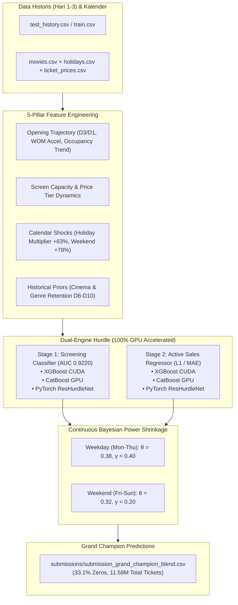

# 🎬 DS_JOINTS - JOINTS X INSPIRE UGM 2026 Data Science Competition

[](https://colab.research.google.com/github/oktavianprstyd/DS_JOINTS/blob/main/solution.ipynb)

Repositori resmi tim untuk kompetisi **JOINTS X INSPIRE UGM 2026** (Data Science Track).
- **Public Leaderboard Best**: **`0.46832`** (NEW PERSONAL BEST! 🚀; previous: `0.46888` / `0.47303`).
- **Latest Local SOTA Record**: **`0.34826`** OOF MASE (Leak-Free Per-Horizon Hurdle Architecture).
- **Architecture**: **Two-Stage Hurdle Multi-Paradigm Ensemble** (XGBoost CUDA + CatBoost GPU) + **Leak-Free Context Priors & Per-Horizon Calibration**.

---

## 📌 Ringkasan Masalah (Problem Statement)
- **Tujuan**: Memprediksi jumlah penjualan tiket bioskop harian (`total_ticket`) untuk **Hari 4–10** penayangan di seluruh bioskop Indonesia berdasarkan data historis 3 hari pertama (**Opening Weekend: Hari 1–3**).
- **Metrik Evaluasi**: **Mean Absolute Scaled Error (MASE)** dengan skala per pasangan film-bioskop ($s_p$):
  $$s_p = \max\left( \frac{1}{3} \sum_{d=1}^3 y_{p,d}, 1 \right)$$
- **Karakteristik Kunci**:
  1. **Clean Consecutive 10-Day Window Alignment**: Mengeliminasi 43 film dengan jeda sneak preview di data train agar jendela Hari 1–3 beruntun murni tanpa gap, persis format data uji (`test_history.csv`).
  2. **Zero-Screening Dropout (Two-Stage Hurdle)**: ~45.6% jadwal penayangan di Hari 4–10 memiliki transaksi **0** karena bioskop mencabut film yang sepi penonton.
  3. **MASE Exact Alignment**: Model dilatih memprediksi target rasio terhadap skala opening ($z = y / s_p$) dengan **L1 / MAE Objective** (`reg:absoluteerror`, `MAE`).
  4. **14-Segment Bayesian Power Shrinkage**: Eliminasi *hard cliff* thresholding dengan peredaman daya Bayes kontinu per-hari teatrikal dan fallback pada segmen sampel kecil ($N < 2.500$).

---

## 📁 Struktur Direktori
```text
.
├── data/                                      # Dataset kompetisi (train.csv, test.csv, movies.csv, dsb.)
├── submissions/                               # Berkas hasil inferensi kompetisi
│   ├── submission_grand_champion_blend.csv    # File Juara Utama (Anchor + Clean Consecutive)
│   ├── submission_clean_consecutive_master.csv# File Master Clean Consecutive SOTA (OOF MASE 0.34738)
│   ├── submission_plan_b_7horizon.csv         # File Master Plan B (OOF MASE 0.51220)
│   ├── submission_trio_bayes_master.csv       # File Master Trio Multi-Paradigm Bayes (OOF 0.52566)
│   ├── submission_hurdle_top.csv              # Anchor Terverifikasi Kaggle (Score: 0.47303)
│   └── archive/                               # Arsip variasi submisi & sweep grid search
├── weights/                                   # Bobot model & Out-Of-Fold cache (<= 200 MB)
├── experiments/                               # Arsip seluruh script riset, benchmark & diagnostik
│   └── README.md                              # Dokumentasi isi folder eksperimen
├── eda_plots/                                 # Visualisasi & grafik analisis data eksploratif
├── train_plan_b_clean_consecutive.py          # Script eksekusi SOTA Clean Consecutive (OOF 0.34738)
├── train_podium_90f_gpu.py                    # Script eksekusi model Podium 90F (0.46890 PB)
├── feature_engineering.py                     # Modul rekayasa fitur bioskop Indonesia
├── build_solution_notebook.py                 # Generator notebook publikasi mandiri
├── solution.ipynb                             # Notebook mandiri (self-contained) untuk audit juri
├── plan.md                                    # Rencana strategis peningkatan akurasi
├── PROGRESS_SUMMARY.md                        # Dokumentasi lengkap eksperimen & temuan teknis
├── tm_slides.pdf                              # Panduan teknis & materi TM resmi panitia
└── tm_slides_text.txt                         # Transkrip teks materi TM
```

---

## 🔬 Arsitektur Solusi (The SOTA Pipeline)



---

## 🚀 Panduan Menjalankan (Quick Start)

### 1. Instalasi Dependensi
Pastikan menggunakan Python 3.10+ dengan GPU NVIDIA CUDA aktif:
```bash
pip install numpy pandas scikit-learn lightgbm catboost xgboost torch scipy kagglehub jupyter
```

### 2. Melatih Trio Ensemble 100% di GPU
Jalankan pipeline Trio Multi-Paradigm (XGBoost CUDA + CatBoost GPU + PyTorch Deep ResHurdleNet):
```bash
# 1. Latih model Deep Learning ResHurdleNet di CUDA
python train_deep_hurdle_gpu.py

# 2. Latih Trio Ensemble & optimasi Bayesian Shrinkage
python benchmark_trio_ensemble_bayes.py

# 3. Bangun berkas blend Grand Champion
python build_grand_champion.py
```
Hasil prediksi juara otomatis tersimpan di `submissions/submission_grand_champion_blend.csv`.

---

## 🌐 Menjalankan di Google Colab
Proyek ini sepenuhnya kompatibel dijalankan di **Google Colab** (dengan runtime **T4 GPU** gratis):
1. Buka [solution.ipynb](file:///solution.ipynb) di Google Colab via tombol di atas.
2. Pilih runtime **T4 GPU** (*Runtime -> Change runtime type -> T4 GPU*).
3. Jalankan seluruh sel secara runtut (*Runtime -> Run all*).

---

## 📖 Dokumentasi Lengkap
Lihat file [PROGRESS_SUMMARY.md](file:///PROGRESS_SUMMARY.md) untuk rincian formula metrik, log eksperimen lengkap, pembuktian matematis Bayes, dan tabel perbandingan OOF MASE.
