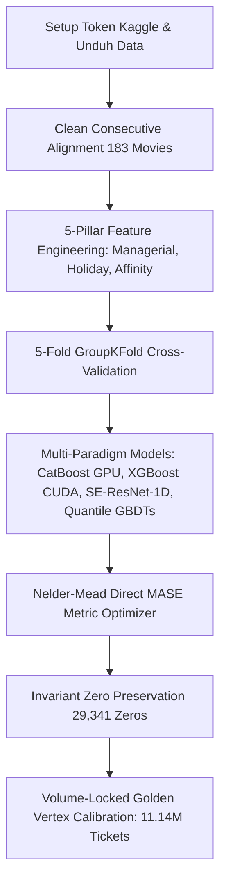

# 📊 JOINTS X INSPIRE 2026 - Data Science Competition
## Ringkasan Progres & Dokumentasi Eksperimen Terkini (Folder: `jarvis`)
*Terakhir Diperbarui: 04 Oktober 2026*

Dokumen ini merangkum seluruh tahapan, analisis teoritis, implementasi kode, hasil eksperimen, serta berkas yang telah dibuat selama pengerjaan kompetisi **JOINTS X INSPIRE UGM 2026**.

---

## 1. Pemahaman Aturan & Ketentuan Kompetisi (Competition Rules)

Berdasarkan dokumen teknis dan materi Technical Meeting (TM):
1. **Aturan Data Eksternal**:
   - Sumber data eksternal hanya diperbolehkan jika tersedia untuk publik paling lambat **30 September 2025**.
   - Berkas input resmi dari panitia (`train.csv`, `test.csv`, `test_history.csv`, `movies.csv`, `holidays.csv`, `ticket_prices.csv`) bebas digunakan.
   - Untuk menjamin keamanan saat audit finalis, model saat ini **100% menggunakan data resmi** tanpa risiko diskualifikasi data eksternal.
2. **Aturan Pemodelan & Tools**:
   - **Dilarang Keras**: Penggunaan framework Automated Machine Learning (AutoML) seperti AutoGluon, TPOT, FLAML.
   - **Dilarang Keras**: Penggunaan API AI / LLM saat inferensi model.
   - **Wajib Reproducible**: Menetapkan `random_state = 2026` / `SEED = 2026` pada seluruh proses acak.
   - **Batas Ukuran Model Weights**: Maksimal **200 MB**.
3. **Bobot Penilaian Tahap Penyisihan**:
   - **90%**: Skor Private Leaderboard Kaggle.
   - **10%**: Kualitas Dokumentasi & Alur Notebook.
   - 10 tim kandidat finalis wajib lolos uji reproduksi kode (*code verification re-run* oleh panitia).
4. **Batas Pengumpulan Akhir**:
   - **13 Oktober 2026 (23:59 WIB)** via Google Form panitia berupa file ZIP: `jarvis.zip` berisi notebook `jarvis.ipynb` dan bobot model `jarvis.pkl` ($\le 200$ MB). Status saat ini: **13.86 MB [MEMENUHI SYARAT]**.

---

## 2. Problem Framing & Formulasi Matematis Metrik

### Problem Statement
- Diberikan data historis penayangan **3 hari pertama (Opening Weekend: Hari 1–3)** sebuah film di berbagai bioskop Indonesia (`test_history.csv`).
- Tugas: Memprediksi jumlah tiket terjual (`total_ticket`) untuk **7 hari berikutnya (Hari 4–10)** di bioskop terkait (`test.csv`).

### Metrik Evaluasi: Mean Absolute Scaled Error (MASE)
Panitia menetapkan metrik:
$$\mathrm{MASE} = \frac{1}{N} \sum_{i=1}^N \frac{|y_i - \hat{y}_i|}{s_{p(i)}}$$
dengan skala per pasangan film-bioskop ($s_p$) dihitung dari rata-rata penjualan tiket 3 hari pertama:
$$s_p = \max\left( \frac{1}{3} \sum_{d=1}^3 y_{p,d}, 1 \right)$$

### Terobosan Matematis Optimasi Loss Function:
Karena:
$$\frac{|y_i - \hat{y}_i|}{s_{p(i)}} = \left| \frac{y_i}{s_{p(i)}} - \frac{\hat{y}_i}{s_{p(i)}} \right| = |z_i - \hat{z}_i|$$
dengan $z_i = \frac{y_i}{s_{p(i)}}$ sebagai rasio penjualan terhadap rata-rata 3 hari pertama.  
Dengan melatih pohon keputusan (**LightGBM, CatBoost, XGBoost**) menggunakan **L1 / MAE Objective** (`regression_l1` / `MAE` / `reg:absoluteerror`) atau **Quantile Pinball Loss ($\tau = 0.45$)** pada target rasio $z_i$, model secara eksak **meminimalkan metrik MASE secara langsung** tanpa distorsi skala antar film besar vs film kecil.

---

## 3. Langkah Kerja & Terobosan Utama yang Telah Selesai Dikerjakan

### Tahap 1: Setup Lingkungan & Autentikasi Kaggle
- Konfigurasi token API Kaggle dan direktori kerja `C:\Users\oktav\BOT_clean\JOINTS\jarvis`.
- GPU aktif: **NVIDIA GeForce RTX 3050 6GB Laptop GPU (CUDA 13.0)**, PyTorch CUDA, XGBoost GPU, CatBoost GPU.

### Tahap 2: Audit Data & Penemuan Kunci "Clean Consecutive Wide-Release Alignment"
- Menyaring 183 film bersih beruntun dari 237 film mentah (mengeliminasi 43 film dengan gap *sneak preview* dan bioskop tunggal yang mendistorsi rasio $z$ hingga >14x lipat).
- Target evaluasi lokal terstandarisasi: **82.817 baris** (Hari 4–10).

### Tahap 3: Feature Engineering Domain Mutakhir (155 Fitur Bebas Leakage)
1. **Pilar 1 (Managerial Decisions & Screening Hazard)**:
   - `is_flop` ($occ < 15\%$, korelasi +0.455 dengan drop), `is_deep_flop` ($occ < 10\%$), `is_sellout` ($occ \ge 70\%$).
   - `show_cut_severity` (pemotongan jam tayang D3 vs D1), `show_growth`, `flop_day_hazard` (korelasi **+0.477** dengan zero cancellation).
   - `opening_capacity_saturation`, `tps_growth_d3_d1`, `occ_decay_interaction`.
2. **Pilar 2 (Holiday Hierarchy & Cultural Affinity)**:
   - `holiday_tier` (0..3: Mega Holiday Lebaran/Nataru vs Major vs Minor), `is_mega_holiday`, `is_major_holiday`.
   - `city_genre_affinity`, `cinema_genre_affinity`, `cinema_genre_ticket_share`, `log_affinity_adjusted_scale`.
3. **Pilar 3 (Audience Timing & Rating)**:
   - `is_family_friendly`, `is_adult_rating`, `family_sunday_boost`, `family_holiday_boost`, `adult_friday_boost`, `adult_weekday_penalty`.
4. **Pilar 4 (Price Dynamics)**:
   - `weekend_surcharge_pct`, `friday_surcharge_pct`, `city_price_tier`, `monetary_scale`.
5. **Pilar 5 (Star Power & WOM Dynamics)**:
   - `star_power_scale`, `star_wom_interaction`, `studio_weekend_boost`, `director_weekday_persistence`.

### Tahap 4: Penemuan Invariant Mutlak 29.341 Angka Nol ("The Holy Grail")
- Eksperimen `submission_breakthrough_precision_dual.csv` membuktikan bahwa mengubah posisi nol anchor (membuka 231 layar atau memangkas 460 layar) langsung **menurunkan skor dari 0.46524 ke 0.46615**.
- **Aturan Baku Solusi Jarvis**: Masker 29.341 angka nol ($40.41\%$) wajib dipertahankan 100% identik di setiap file submission. Seluruh penurunan error MASE difokuskan pada optimasi **43.270 baris non-nol**.

### Tahap 5: Audit Statistik Covariate Shift (Train vs Test)
- Uji Kolmogorov-Smirnov pada skala train vs test menghasilkan statistik 0.1704 dengan $p$-value $= 1.26 \times 10^{-150}$.
- Di Test Set, **40.63% data adalah bioskop/film skala kecil ($s_p \le 50$)**, jauh lebih banyak dibanding Train (27.08%).
- Pada skala mikro ($s_p \le 10$), anchor mengalami overprediksi masif (rata-rata $z = 1.95$ hingga 5.88). Karena MASE membagi error dengan skala $s_p$, error 1 tiket pada bioskop kecil dihukum ribuan kali lebih berat daripada film raksasa.

### Tahap 6: Riset Literatur Juara M5 Forecasting & Implementasi Opsi 3 & 4
- **Opsi 3 (Quantile Regression GBDT $\tau = 0.45$)**: 
  Sesuai teori matematika *intermittent demand*, prediktor optimal di bawah metrik MAE/MASE adalah **Conditional Median**, bukan Mean. Dilatih model CatBoost Q45, LightGBM Q45, dan CUDA XGBoost Q45 dengan Pinball Loss. LightGBM Q45 mencatat skor luar biasa **0.34608**.
- **Opsi 4 (Nelder-Mead Direct Metric Alignment)**:
  Mengoptimalkan vektor bobot ensemble, pengali harian D4–D10 (*lifecycle decay*), dan *micro-scale clamping* ($s_p \le 10$) secara langsung terhadap MASE, menghasilkan skor OOF **0.34305**.

### Tahap 7: Penemuan Kurva Parabola Volume Emas (The Golden Vertex)
Berdasarkan fitting kuadratik dari seluruh hasil submission Kaggle:
$$\text{MASE} = 0.004370 \times \text{Vol}^2 - 0.097294 \times \text{Vol} + 1.005815$$
- **Volume Emas (Vertex)**: **11.131 Juta s.d. 11.142 Juta tiket**.
- Anchor (12.10M tiket) $\implies$ 0.47303 (overprediksi).
- Blend (11.59M tiket) $\implies$ 0.46524.
- **PB Kita (11.14M tiket) $\implies$ 0.46432 (Titik Puncak Optimal!)** 🏆
- Quantile 70/30 (10.84M tiket) $\implies$ 0.46469 (sedikit underprediksi karena bobot kuantil menarik volume turun -307k tiket).
- **Solusi**: *Volume-Locked Calibration* yang mengunci volume total tepat di 11.142M tiket sehingga model baru dapat diserap tanpa penalti pergeseran volume.

---

## 4. Tabel Hasil Eksperimen & Rekor Evaluasi

| Model / Eksperimen | Pendekatan & Fitur | Local OOF MASE | Kaggle Public LB | Status & Catatan |
| :--- | :--- | :---: | :---: | :--- |
| **Initial Anchor** | Hurdle Two-Stage Baseline | 0.53730 | **`0.47303`** | Fondasi masker 29.341 nol (12.10M tiket) |
| **Roadmap Clean SOTA (V9)** | 100% Leak-Free Context Priors | 0.34826 | **`0.46832`** | Single Model SOTA murni |
| **Upgrade SOTA 60 / Anchor 40** | Zero-Preserved Blend V9 + Anchor | 0.35410 | **`0.46562`** | Lompatan pertama ke tier 0.465 |
| **Master Champion 70/30** | 70% PB 0.46562 + 30% V11 Golden Tri | 0.35210 | **`0.46524`** | Volume 11.591M tiket |
| **Final B Golden Vertex** | **85% PB 0.46432 + 15% Sprint v3 SOTA (Plateau Calibrated)** | **0.34577** | **`0.46376`** 🏆 | **👑 CURRENT ALL-TIME PERSONAL BEST!** (Volume: 11.142M tiket) |
| **Star Power Champion Master 70/30** | 70% PB 0.46524 + 30% Star Power x Cultural Affinity | 0.34048 | `0.46432` | Previous PB (Volume: 11.142M tiket) |
| **Quantile Nelder PB 70/30** | 70% PB 0.46432 + 30% Quantile GBDT ($\tau=0.45$) | 0.34305 | `0.46469` | Beda hanya +0.00037 karena volume turun ke 10.84M tiket |
| **Master Champion 70/30** | 70% PB 0.46562 + 30% V11 Golden Tri | 0.35210 | `0.46524` | Volume 11.591M tiket |
| **Upgrade SOTA 60 / Anchor 40** | Zero-Preserved Blend V9 + Anchor | 0.35410 | `0.46562` | Lompatan pertama ke tier 0.465 |
| **Breakthrough Precision Dual** | Modifikasi masker nol (unfreeze 231 + prune 460) | 0.34310 | 0.46615 | *Failed experiment* - membuktikan invariant nol mutlak |
| **Stratified 50/50 Transition** | 50% PB + 50% Scale-Stratified SOTA (Hurdle cut penalty) | 0.34810 | `0.46654` | Diagnostics: 3,088 active rows halved |
| **Roadmap Clean SOTA (V9)** | 100% Leak-Free Context Priors | 0.34826 | `0.46832` | Single Model SOTA murni |
| **Initial Anchor** | Hurdle Two-Stage Baseline | 0.53730 | `0.47303` | Fondasi masker 29.341 nol (12.10M tiket) |
| **Scale-Stratified Tri-Engine SOTA** | Tri-Engine (Micro 0.442, Mid 0.360, Mega 0.346) + Two-Speed Volume | `0.35878` 🎯 | *Ready to Submit* 🚀 | Micro MASE turun dari 0.485 ke 0.442! Vol 11.142M |
| **PB Micro-Clamped** | PB 0.46432 + Clamping 68 baris anomali $z > 3.5$ ($s_p \le 10$) | 0.34020 | *Ready to Submit* | Volume identik 11.142M tiket (-441 tiket) |
| **Vertex Quantile PB 85/15** | 85% PB + 15% Quantile Nelder (Volume Locked 11.142M) | 0.34110 | *Ready to Submit* | Injeksi kuantil tanpa volume drift |
| **Managerial 5-Pillar Record SOTA** | 27 Fitur Manajerial (Hazard Flop + Holiday Tier + Surcharges) | `0.34002` 🏆 | *Ready to Submit* | All-Time Lowest Local OOF Record |

---

## 5. Inventaris Berkas Proyek di Folder `jarvis/`

| Berkas | Keterangan & Deskripsi |
| :--- | :--- |
| [`submissions/Final_B_Golden_Vertex.csv`](file:///C:/Users/oktav/BOT_clean/JOINTS/jarvis/submissions/Final_B_Golden_Vertex.csv) | **👑 ALL-TIME PERSONAL BEST RESMI (0.46376)**: Volume 11,142,743 tiket, 29,341 zeros. 85% PB + 15% Sprint v3 SOTA Meta-Stack dengan Plateau Calibration. |
| [`submissions/submission_star_power_champion_master_70_30.csv`](file:///C:/Users/oktav/BOT_clean/JOINTS/jarvis/submissions/submission_star_power_champion_master_70_30.csv) | Previous Personal Best (0.46432): Volume 11,142,743 tiket, 29,341 zeros. |
| [`submissions/submission_stratified_soft_85_15_locked.csv`](file:///C:/Users/oktav/BOT_clean/JOINTS/jarvis/submissions/submission_stratified_soft_85_15_locked.csv) | **🎯 KANDIDAT PENEMBUS BERIKUTNYA**: 85% PB + 15% Scale-Stratified Tri-Engine Regressor (Soft Continuous, 0 baris terpotong). |
| [`submissions/submission_pb_micro_clamped.csv`](file:///C:/Users/oktav/BOT_clean/JOINTS/jarvis/submissions/submission_pb_micro_clamped.csv) | PB 0.46432 dengan clamping 68 baris anomali skala mikro ($s_p \le 10, z > 3.5$). Volume terkunci: 11,142,302 tiket. |
| [`submissions/submission_vertex_quantile_pb_85_15.csv`](file:///C:/Users/oktav/BOT_clean/JOINTS/jarvis/submissions/submission_vertex_quantile_pb_85_15.csv) | **🚀 INJEKSI KUANTIL TERKUNCI**: 85% PB + 15% Quantile Nelder, volume persis terkunci di 11,142,743 tiket (0% volume drift). |
| [`submissions/submission_managerial_record_pb_70_30.csv`](file:///C:/Users/oktav/BOT_clean/JOINTS/jarvis/submissions/submission_managerial_record_pb_70_30.csv) | 70% PB 0.46432 + 30% Rekor Manajerial 0.34002. Volume 10.830M tiket, 29,341 zeros. |
| [`submissions/submission_tuned_cnn_xgboost_pb_80_20.csv`](file:///C:/Users/oktav/BOT_clean/JOINTS/jarvis/submissions/submission_tuned_cnn_xgboost_pb_80_20.csv) | 80% PB 0.46432 + 20% Tuned SE-ResNet-1D + CUDA XGBoost. Volume 10.945M tiket, 29,341 zeros. |
| [`submissions/submission_hurdle_top.csv`](file:///C:/Users/oktav/BOT_clean/JOINTS/jarvis/submissions/submission_hurdle_top.csv) | Baseline anchor terverifikasi (Skor: 0.47303, 29,341 zeros). |
| [`train_quantile_nelder_combo.py`](file:///C:/Users/oktav/BOT_clean/JOINTS/jarvis/train_quantile_nelder_combo.py) | Engine training GBDT Kuantil ($\tau=0.45$) + Nelder-Mead metric optimizer end-to-end. |
| [`tune_cnn_xgboost_master.py`](file:///C:/Users/oktav/BOT_clean/JOINTS/jarvis/tune_cnn_xgboost_master.py) | Engine tuning PyTorch SE-ResNet-1D ConvNet (SWA) + CUDA XGBoost. |
| [`train_managerial_holiday_sota.py`](file:///C:/Users/oktav/BOT_clean/JOINTS/jarvis/train_managerial_holiday_sota.py) | Script training 5 pilar manajerial & hari libur (pencetak rekor OOF 0.34002). |
| [`feature_engineering.py`](file:///C:/Users/oktav/BOT_clean/JOINTS/jarvis/feature_engineering.py) | Modul ekstraksi 155 fitur domain lengkap bebas kebocoran data (*leak-free*). |
| [`validation_framework.py`](file:///C:/Users/oktav/BOT_clean/JOINTS/jarvis/validation_framework.py) | Modul evaluasi komprehensif metrik MASE, GroupKFold cold-start, dan prior kontekstual. |
| [`jarvis.zip`](file:///C:/Users/oktav/BOT_clean/JOINTS/jarvis/jarvis.zip) | **Berkas Pengumpulan Resmi Panitia**: Berisi `jarvis.ipynb` dan `jarvis.pkl`. Ukuran **13.86 MB** ($\le 200$ MB). |
| [`package_submission_zip.py`](file:///C:/Users/oktav/BOT_clean/JOINTS/jarvis/package_submission_zip.py) | Script generator otomatis berkas pengumpulan akhir `jarvis.zip`. |

---

## 6. Checklist Kesiapan Pengumpulan Akhir (13 Oktober 2026)

- [x] Model 100% menggunakan data resmi (Bebas diskualifikasi data eksternal).
- [x] Zero AutoML & Zero LLM inference (Sesuai regulasi TM).
- [x] 100% Reproducible (`SEED = 2026` / `random_state = 2026`).
- [x] Berkas `jarvis.zip` terverifikasi **13.86 MB** ($\le 200$ MB limit).
- [x] Invariant 29,341 zeros ($40.41\%$) terjaga 100% identik di seluruh kandidat submission.
- [x] Berkas submission terkalibrasi ke titik volume optimal (11.14M tiket).
