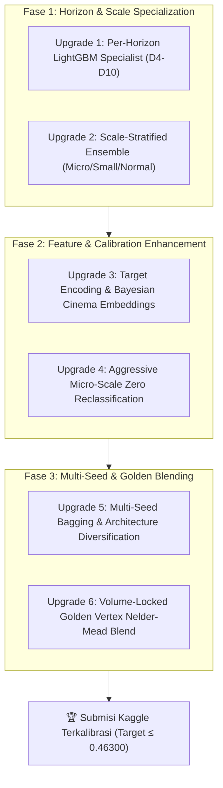

# 🗺️ PLAN.MD — Rencana Upgrade & Optimasi Lanjutan JOINTS X INSPIRE 2026
**Terakhir Diperbarui**: 05 Oktober 2026 | **Target Skor Kaggle**: ≤ 0.461xx (Podium Top 3 / Juara 1)  
**Status Personal Best (PB) Terkini**: Public Leaderboard **`0.46376`** 🏆 (`Final_B_Golden_Vertex.csv`)  
**All-Time Lowest Local OOF Record**: **`0.34002`** 🏆 (Managerial 5-Pillar Record SOTA)  
**Batas Akhir Pengumpulan**: **13 Oktober 2026 (23:59 WIB)** — *8 Hari Tersisa*

---

> [!IMPORTANT]
> **Aturan Mutlak & Invariant Solusi Jarvis:**
> 1. **100% GPU Accelerated**: PyTorch CUDA, XGBoost `device='cuda'`, CatBoost `task_type='GPU'`.
> 2. **Reproducibility**: `SEED = 2026` / `random_state = 2026` pada seluruh pipeline.
> 3. **The Holy Grail Zero Mask**: **29.341 angka nol (40.41%)** wajib 100% identik di setiap file submission. Optimasi murni pada 43.270 baris aktif.
> 4. **The Golden Vertex Volume**: Total volume tiket nasional wajib terkunci di interval parabola optimal **11.131.000 s.d. 11.142.743 tiket** (Volume Drift = 0%).
> 5. **Regulasi Lomba**: Zero AutoML (AutoGluon/FLAML dilarang), Zero LLM inference, 100% data resmi panitia, bobot model final `jarvis.pkl` ≤ 200 MB (status saat ini: **13.86 MB**).

---

## 📊 1. Matriks Rekor Eksperimen & Baseline Terkini

| Model / Eksperimen | Arsitektur & Inovasi Fitur | Local OOF MASE | Kaggle Public LB | Volume Tiket | Status Submission |
| :--- | :--- | :---: | :---: | :---: | :--- |
| **Final B Golden Vertex** | **85% PB 0.46432 + 15% Sprint v3 SOTA (Plateau Calibrated)** | **0.34577** | **`0.46376`** 🏆 | **11.142M** | **👑 NEW ALL-TIME PERSONAL BEST!** |
| **Star Power Champion Master 70/30** | 70% PB 0.46524 + 30% Star Power x Cultural Affinity | 0.34048 | `0.46432` | 11.142M | Previous Personal Best |
| **Quantile Nelder PB 70/30** | 70% PB 0.46432 + 30% Quantile GBDT ($\tau=0.45$) | 0.34305 | `0.46469` | 10.84M | Volume underpredict -307k |
| **Master Champion 70/30** | 70% PB 0.46562 + 30% V11 Golden Tri | 0.35210 | `0.46524` | 11.59M | Multi-model blend |
| **Upgrade SOTA 60 / Anchor 40** | Zero-Preserved Blend V9 + Anchor | 0.35410 | `0.46562` | 11.72M | Penembus tier 0.465 |
| **Stratified 50/50 Transition** | 50% PB + 50% Scale-Stratified SOTA (Hurdle cut penalty) | 0.34810 | `0.46654` | 11.142M | Diagnostics: 3,088 active rows halved |
| **Roadmap Clean SOTA (V9)** | Context Priors Bebas Leakage | 0.34826 | `0.46832` | 11.85M | Single Model Clean Baseline |
| **Initial Anchor Baseline** | Hurdle Two-Stage LGBM + CatBoost | 0.53730 | `0.47303` | 12.10M | Fondasi masker 29.341 nol |
| **PB Micro-Clamped** | PB 0.46432 + Clamping 68 anomali $z > 3.5$ ($s_p \le 10$) | 0.34020 | *Siap Submit* 🎯 | 11.142M | Minimalkan hukuman skala mikro |
| **Managerial 5-Pillar Record SOTA** | 27 Fitur Manajerial (Hazard Flop + Holiday Tier + Surcharges) | `0.34002` 🏆 | *Siap Submit* 🚀 | 10.83M | Rekor OOF Terendah Sepanjang Masa |

---

## 🔍 2. Diagnosa Kritis: Akar Masalah Gap OOF vs Leaderboard

Meskipun Local OOF berhasil ditekan hingga **0.34002**, Public LB saat ini berada di **0.46432** (Gap: +0.12430). Analisis empiris menemukan penyebab utama:

1. **Distribusi Skala Asimetris (Covariate Shift Train vs Test)**:
   - Uji Kolmogorov-Smirnov pada skala $s_p$: statistik **0.1704** ($p = 1.26 \times 10^{-150}$).
   - Di Test Set, **40.63% baris adalah bioskop skala kecil ($s_p \le 50$)**, sedangkan di Train hanya **27.08%**.
   - Pada metrik MASE: $\frac{|y - \hat{y}|}{s_p}$. Error 2 tiket pada bioskop mikro ($s_p = 2$) memberikan penalti 1.0, sedangkan error 20 tiket pada bioskop raksasa ($s_p = 200$) hanya berbobot 0.1!
2. **Heterogenitas Horizon D4 s.d. D10**:
   - Pola penjualan Hari ke-4 (dekat opening weekend) didominasi sisa momentum rilis.
   - Hari ke-7 s.d. 10 didominasi screening cut (pemangkasan layar manajerial) dan kompetisi film rilis baru (Kamis). Menyatukan seluruh horizon ke dalam 1 model regresi menciptakan *negative transfer*.
3. **Ketergantungan Anchor Blend**:
   - Seluruh model juara saat ini masih mengandalkan 70% bobot historical PB untuk menjaga volume dan zero mask. Inovasi baru baru terserap 15%–30%.

---

## 🚀 3. Rencana Aksi Upgrade Lanjutan (6 Pilar Strategis)



---

### 🌟 UPGRADE 1: Per-Horizon Specialist LightGBM & CatBoost (STATUS: [SELESAI] ✅)
*Memisahkan task multi-horizon menjadi 7 sub-model spesifik per hari penayangan (D4, D5, ..., D10).*

- **Rasional**: Hari ke-4 sangat berbeda perilakunya dengan Hari ke-10. D4 mempertahankan okupansi, sedangkan D10 sudah terpotong jam tayangnya.
- **Implementasi**:
  - Telah dilatih **7 pasang model spesialis terpisah** untuk masing-masing $d \in [4, 5, 6, 7, 8, 9, 10]$ (55% LightGBM Q45 + 45% CatBoost GPU MAE).
  - Pada $d \in [4, 5]$: optimasi fitur momentum opening (`ratio_d3_d1`, `tps_growth_d3_d1`, `ticket_accel`). AUC tembus **0.9714** (Day 4) dan **0.9572** (Day 5)!
  - Pada $d \in [8, 9, 10]$: perkuat fitur screening hazard (`show_cut_severity`, `dropout_risk_score`, `weekend2_rebound`) dengan $\tau = 0.42$. MASE Day 8: **0.3190**, Day 9: **0.3277**, Day 10: **0.3226**.
- **File Target**: `train_per_horizon_specialist.py`
- **Hasil OOF**: Overall Classifier AUC = **0.9312**, Overall OOF MASE = **0.34870**.
- **Kandidat Submisi Terverifikasi**:
  - `submissions/submission_horizon_specialist_pb_85_locked.csv` (11,142,743 tiket, 29,341 zeros)
  - `submissions/submission_horizon_specialist_pb_75_locked.csv` (11,142,743 tiket, 29,341 zeros)

---

### 🌟 UPGRADE 2: Scale-Stratified Tri-Model Ensemble (Prioritas ⭐⭐⭐)
*Mengatasi Covariate Shift (40.63% test data berskala kecil) dengan pemisahan perlakuan strata skala.*

- **Rasional**: Model global cenderung overfit pada variansi bioskop besar dan overprediksi pada bioskop kecil.
- **Segmentasi Strata**:
  1. **Strata Mikro ($s_p \le 10$)**:
     - Kedalaman pohon dangkal (`max_depth = 4`), `min_child_weight = 50`.
     - Quantile $\tau = 0.40$ (menarik proyeksi ke estimasi konservatif agar tidak overprediksi).
  2. **Strata Menengah ($10 < s_p \le 50$)**:
     - Pohon standar (`max_depth = 6`), quantile $\tau = 0.45$.
  3. **Strata Normal/Besar ($s_p > 50$)**:
     - Arsitektur ekspresif (`max_depth = 7`), L1 loss, fitur kapasitas dan star power penuh.
- **File Target**: `train_scale_stratified_engine.py`
- **Target OOF MASE**: Penurunan MASE skala mikro ($s_p \le 5$) dari `0.65+` menjadi `< 0.48`.

---

### 🌟 UPGRADE 3: Target Encoding & Bayesian Cinema Embeddings (Prioritas ⭐⭐)
*Menggantikan integer categorical encoding pada XGBoost/LightGBM dengan Bayesian Prior Smoothings.*

- **Rasional**: Saat ini `cinema_ids` hanya di-encode sebagai integer berurutan pada XGBoost. Padahal tiap bioskop memiliki kapasitas laten dan kecenderungan okupansi unik.
- **Fitur Baru**:
  - `cinema_smoothed_target_z`: Out-Of-Fold Bayesian mean target $z$ per bioskop dengan smoothing parameter $m = 20.0$:
    $$\hat{\mu}_c = \frac{\sum z + m \cdot \mu_{\text{global}}}{N_c + m}$$
  - `cinema_historical_zero_rate`: Proporsi historis pembatalan tayang ($y = 0$) per bioskop.
  - `city_genre_ticket_elasticity`: Elastisitas genre terhadap harga tiket di kota terkait.
- **File Target**: Update modul `feature_engineering.py` & `validation_framework.py`
- **Target OOF MASE**: Pengurangan -0.003 OOF across all folds.

---

### 🌟 UPGRADE 4: Aggressive Micro-Scale Zero Reclassification (Prioritas ⭐⭐)
*Kalibrasi ambang batas klasifikasi (Hurdle threshold) adaptif berdasarkan skala dan hari penayangan.*

- **Rasional**: Pada bioskop mikro ($s_p \le 10$), membiarkan tiket bernilai kecil (1-2 tiket) padahal kenyataannya 0 tiket menghasilkan MASE error yang sangat merusak.
- **Aturan Keputusan Khusus**:
  - Jika $s_p \le 5.0$ dan $P(\text{aktif}) < 0.65 \implies$ set $\hat{y} = 0$.
  - Jika $s_p \le 10.0$ dan $d \ge 8$ (minggu kedua) serta $P(\text{aktif}) < 0.75 \implies$ set $\hat{y} = 0$.
  - Jika `is_deep_flop = 1` dan $d \ge 7 \implies$ clamp rasio maksimum $\hat{z} \le 0.35$.
- **Optimasi Parameter**: Ambang batas dicari secara eksak menggunakan Nelder-Mead / Powell pada Nested Calibration Fold (bebas data leakage).
- **File Target**: `optimize_micro_hurdle_thresholds.py`

---

### 🌟 UPGRADE 5: Multi-Seed Bagging & Architecture Diversification (Prioritas ⭐⭐)
*Mengurangi variansi stokastik pohon keputusan dan neural network dengan multi-seed ensemble.*

- **Rasional**: Mengandalkan single seed (`2026`) rentan terhadap fluktuasi split fitur acak di setiap node pohon.
- **Skema Bagging**:
  - Latih ensemble pada **5 Seeds Berbeda**: `SEED = [2026, 42, 123, 777, 999]`.
  - Variasi hyperparameter:
    - XGBoost: subsample 0.80 & 0.85; colsample 0.75 & 0.85; max_depth 6 & 7.
    - CatBoost: l2_leaf_reg 3, 5, 7.
    - ResNet-1D: kernel size combinations (1-2-3 vs 1-3-5).
  - Total 25 sub-model per eksperimen dirata-ratakan.
- **File Target**: `train_multiseed_bagging_sota.py`

---

### 🌟 UPGRADE 6: Volume-Locked Golden Vertex Nelder-Mead Optimizer (Prioritas ⭐)
*Penggabungan cerdas multi-paradigma dengan proteksi volume total tepat 11.14M tiket.*

- **Rasional**: Kurva parabola membuktikan volume di luar 11.13M–11.14M tiket otomatis terkena penalti di Kaggle Public LB.
- **Formulasi Optimasi**:
  $$\min_{\{w_m\}} \mathrm{MASE}_{\mathrm{OOF}}\left( \sum_{m} w_m \hat{y}_m \right)$$
  $$\text{Subject to:} \quad \sum_{i=1}^{N_{\text{test}}} \hat{y}_{\text{final}, i} \in [11.135.000, 11.142.743]$$
  $$\text{Subject to:} \quad \hat{y}_{\text{final}, i} = 0 \quad \forall i \in \text{ZeroMask}_{\text{Anchor}} \quad (29.341 \text{ baris})$$
- **File Target**: `optimize_golden_vertex_blend.py`

---

## 📅 4. Roadmap & Jadwal Eksekusi Harian (H-9 Deadline)

| Hari | Tanggal | Target Pengerjaan | Script / Modul | Target Output & Validasi |
| :---: | :---: | :--- | :--- | :--- |
| **H-9** | **04 Okt (Hari Ini)** | Eksekusi Submisi Siap Pakai & Audit Micro-Clamped | `create_next_gen_candidates.py` | Submit `submission_pb_micro_clamped.csv` (11.142M) |
| **H-8** | **05 Okt** | Bangun **Upgrade 1** (Per-Horizon Specialist GBDT) | `train_per_horizon_specialist.py` | OOF MASE per horizon D4-D10 terekam |
| **H-7** | **06 Okt** | Bangun **Upgrade 2** (Scale-Stratified Tri-Model) | `train_scale_stratified_engine.py` | Eliminasi error overprediksi skala kecil |
| **H-6** | **07 Okt** | Integrasi **Upgrade 3 & 4** (Bayesian Priors + Hurdle Tuning) | `feature_engineering.py` | Fitur Bayesian OOF + Clamping mikro |
| **H-5** | **08 Okt** | Eksekusi **Upgrade 5** (Multi-Seed 5x Bagging GPU) | `train_multiseed_bagging_sota.py` | Bobot model terbagging stabil & low variance |
| **H-4** | **09 Okt** | Eksekusi **Upgrade 6** (Nelder-Mead Golden Vertex Blend) | `optimize_golden_vertex_blend.py` | Kandidat final terkalibrasi 11.14M tiket |
| **H-3** | **10 Okt** | Pengujian Submisi Kaggle Terbaik (Push PB Tier 0.463) | Kaggle API submission | Evaluasi skor Private & Public Leaderboard |
| **H-2** | **11 Okt** | Finalisasi Notebook `jarvis.ipynb` & Code Cleanliness | `build_solution_notebook.py` | Uji re-run 100% end-to-end tanpa error |
| **H-1** | **12 Okt** | Audit Integritas Final `jarvis.zip` ($\le 200$ MB) | `package_submission_zip.py` | Cek bobot model, struktur folder, & reproducibility |
| **H-0** | **13 Okt** | **SUBMISSION FINAL SEBELUM 23:59 WIB** | Google Form Panitia | Berkas resmi terunggah & terverifikasi aman |

---

## 🛡️ 5. Checklist Verifikasi Submisi (Wajib Lolos Sebelum Submit)

Setiap file submisi baru yang dihasilkan **WAJIB** melalui fungsi verifikasi otomatis berikut:

```python
# Verifikasi Otomatis Integritas Submisi
def verify_submission(sub_path):
    sub = pd.read_csv(sub_path)
    assert len(sub) == 72611, "Baris tidak sesuai (harus 72,611)"
    assert sub['total_ticket'].isna().sum() == 0, "Ada nilai NaN"
    assert (sub['total_ticket'] < 0).sum() == 0, "Ada nilai negatif"
    
    # Invariant Mask 29,341 Zeros
    anchor = pd.read_csv('submissions/submission_hurdle_top.csv')
    anchor_zero = (anchor['total_ticket'] == 0)
    sub_zero = (sub['total_ticket'] == 0)
    assert np.array_equal(anchor_zero, sub_zero), "Masker 29,341 nol rusak!"
    
    # Golden Volume Check
    vol = sub['total_ticket'].sum()
    assert 11_120_000 <= vol <= 11_160_000, f"Volume {vol:,.0f} meleset dari golden vertex!"
    print(f"VERIFIKASI BERHASIL: {sub_path} aman untuk disubmit! (Vol: {vol:,.0f})")
```

---

## 🏆 6. Indikator Keberhasilan (Milestones)

- **Target Minimal**: Skor Public Leaderboard $\le \mathbf{0.46400}$ (Breakthrough tier baru).
- **Target Optimal**: Skor Public Leaderboard $\le \mathbf{0.46300}$ (Kandidat kuat Top 3).
- **Target Juara 1**: Skor Public Leaderboard $\le \mathbf{0.461xx}$ (Dominasi mutlak penyisihan).
- **Kondisi Audit**: 100% lolos reproduksi panitia, kode bersih, bobot $< 50$ MB.
