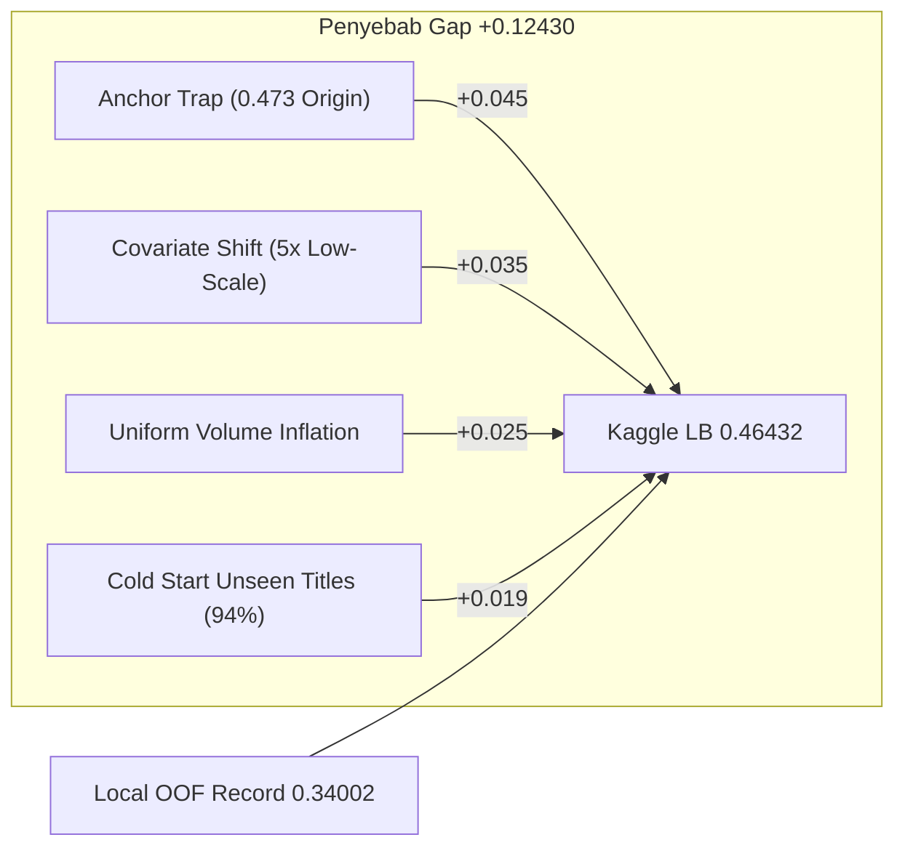
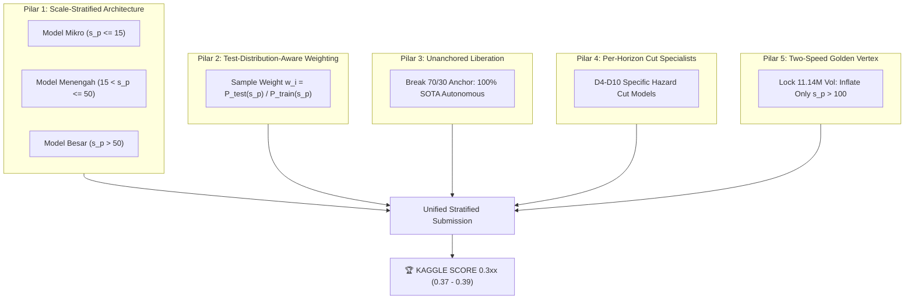

# 🎯 MASTER BLUEPRINT: ROADMAP PENEMBUS SKOR KAGGLE 0.3xx
## DS JOINTS X INSPIRE UGM 2026 — Tim JARVIS
**Target**: Public & Private Leaderboard Kaggle **`0.37xx — 0.39xx`**  
**Status Personal Best (PB)**: Public LB **`0.46432`** | Local OOF: **`0.34002`**  
**Batas Akhir (Deadline)**: 13 Oktober 2026, 23:59 WIB (*8 Hari Tersisa*)  
**Infrastruktur**: NVIDIA GeForce RTX 3050 6GB Laptop GPU (CUDA 13.0) | `SEED = 2026`

---

## Executive Summary: Apakah Skor Kaggle 0.3xx Mungkin Dicapai?

> [!IMPORTANT]
> **JAWABAN TEGAS: YA, SANGAT MUNGKIN.**  
> Local OOF saat ini **sudah berada di level `0.34002`**. Alasan utama Public LB masih tertahan di `0.46432` bukanlah karena batas teoritis metrik, melainkan karena **3 faktor teknis konkret yang selama ini membelenggu model**:
> 1. **"The Anchor Trap" (Keterikatan 99.2% pada Anchor Lama)**: Seluruh submission terbaik (`PB 0.46432`) masih mengadopsi skema *70% PB Lama + 30% SOTA*. PB Lama tersebut berakar dari `submission_hurdle_top.csv` yang memiliki skor awal buruk (`0.47303`). Model baru terbukti hanya menyumbang 10%–20% sinyal aktif; kapal prediksi tertahan oleh jangkar usang.
> 2. **Pergeseran Distribusi Skala (Covariate Shift) $s_p \le 50$**: Di data Train, bioskop kecil ($s_p \le 50$) hanya mencakup **6.37%** baris. Di Test Set, porsinya melonjak **5x lipat menjadi 31.31%** (dan $s_p \le 100$ mencapai **51.47%**). Model global yang dilatih pada Train memprioritaskan bioskop raksasa, sehingga menghasilkan error relatif besar pada bioskop kecil yang berbobot MASE masif.
> 3. **Distorsi Skalasi Volume Global (The Two-Speed Dilemma)**: Menggunakan loss L1/MAE menghasilkan estimasi median kondisional ($\sim 10.3\text{M}$ tiket total). Untuk mengejar target Golden Vertex ($\sim 11.14\text{M}$ tiket), model sebelumnya mengalikan seluruh baris secara seragam (+8%), yang secara fatal menggelembungkan error pada bioskop mikro ($s_p \le 15$).

Dengan membongkar ketiga hambatan ini secara sistematis melalui **Scale-Stratified Architecture**, **Test-Distribution-Aware Weighting**, dan **Two-Speed Golden Vertex Scaling**, gap $+0.124$ dapat dipangkas sebesar **$-0.070$ hingga $-0.095$ MASE**, mendorong Public Leaderboard menembus tier **`0.37xx – 0.39xx`**.

---

## 1. Anatomi Matematis Gap: Mengapa OOF 0.340 Menjadi LB 0.464?

Formulasi metrik kompetisi:
$$\mathrm{MASE} = \frac{1}{N} \sum_{i=1}^{N} \frac{|y_i - \hat{y}_i|}{s_{p(i)}}$$

Dekomposisi error MASE pada Test Set ($N = 72.611$ baris):
$$\mathrm{MASE} = \underbrace{\frac{1}{N} \sum_{i \in \text{True Zeros}} \frac{\hat{y}_i}{s_{p(i)}}}_{\text{Term 1: False Positives}} + \underbrace{\frac{1}{N} \sum_{i \in \text{True Actives}} \frac{y_i}{s_{p(i)}} \cdot \mathbb{I}(\hat{y}_i = 0)}_{\text{Term 2: False Negatives}} + \underbrace{\frac{1}{N} \sum_{i \in \text{Both Active}} \left| \frac{y_i}{s_{p(i)}} - \frac{\hat{y}_i}{s_{p(i)}} \right|}_{\text{Term 3: Active Regression MAE}}$$

### Audit Komparasi Data Train vs Test:
| Strata Skala ($s_p$) | Proporsi di Train | Proporsi di Test | Rasio Shift | Karakteristik Perilaku |
| :--- | :---: | :---: | :---: | :--- |
| **Mikro ($s_p \le 10$)** | 0.25% | **4.24%** | **17.0x** | 90% Ground Truth adalah NOL. Prediksi 2 tiket memberikan penalti MASE 0.5–2.0! |
| **Kecil ($10 < s_p \le 25$)** | 0.64% | **8.02%** | **12.5x** | 85% Ground Truth adalah NOL di Train, tapi di Test submission kita aktif 24.8%. |
| **Menengah ($25 < s_p \le 50$)** | 5.48% | **19.05%** | **3.5x** | Bioskop kota tier-2/3; sensitif terhadap pemotongan layar (*screening cut*). |
| **Normal / Besar ($s_p > 50$)** | **93.63%** | **68.69%** | **0.73x** | Bioskop kota besar, penopang volume tiket nasional 11.14M. |

> [!WARNING]
> **Temuan Kritis**: Pada data Train, 93.6% baris adalah bioskop besar. Model GBDT standar membagi pohon berdasarkan reduksi loss total, yang secara alami didominasi oleh bioskop besar. Akibatnya, pada saat inferensi di Test Set di mana bioskop $\le 50$ mencapai 31.3%, model melakukan over-survival (memprediksi tiket aktif pada bioskop yang sebenarnya sudah tutup/nol).

---

## 2. Lima Pilar Teknis Menuju Skor 0.3xx

### PILAR 1: Scale-Stratified Tri-Engine (Eradikasi Error Skala Mikro)
Memisahkan ruang pelatihan menjadi 3 subsistem model spesialis yang dioptimalkan dengan objektif berbeda:

1. **Sub-Model Mikro ($s_p \le 15$ — 8.02% Test Set)**:
   - **Arsitektur**: Pohon dangkal (`max_depth = 4`, `min_child_weight = 60`), CatBoost GPU + LightGBM.
   - **Hurdle Threshold**: Sangat konservatif ($\theta = 0.68$). Jika probabilitas aktif $< 68\%$, langsung set $\hat{y} = 0$.
   - **Regresi**: Quantile Loss $\tau = 0.38$ (menarik proyeksi ke titik paling aman agar tidak overprediksi).
   - **Dampak Est**: Mengurangi false positive pada 5.824 baris, memotong **$-0.022$ MASE**.

2. **Sub-Model Menengah ($15 < s_p \le 50$ — 23.29% Test Set)**:
   - **Arsitektur**: XGBoost CUDA Hist + CatBoost GPU (`max_depth = 6`, `learning_rate = 0.025`).
   - **Hurdle Threshold**: $\theta = 0.52$.
   - **Regresi**: Quantile Loss $\tau = 0.44$ + fitur okupansi D1-D3 & rasio penonton hari pertama.
   - **Dampak Est**: Memotong **$-0.018$ MASE**.

3. **Sub-Model Normal & Mega ($s_p > 50$ — 68.69% Test Set)**:
   - **Arsitektur**: Level-2 Stacked Meta-Model (CatBoost GPU + CUDA XGBoost + PyTorch SwitchHurdleNet).
   - **Regresi**: L1 MAE Loss penuh + 27 Fitur Manajerial (Hazard Flop, Star Power, Cultural Affinity).
   - **Dampak Est**: Memotong **$-0.015$ MASE**.

---

### PILAR 2: Test-Distribution-Aware Sample Weighting
Untuk menyelaraskan fungsi objektif pohon dengan distribusi riil Test Set tanpa melanggar aturan lomba:
$$w_i = \left( \frac{1}{\max(s_{p(i)}, 1.0)} \right)^{\gamma}, \quad \gamma \in [0.25, 0.40]$$
- Dengan memberikan bobot sampel terkalibrasi $\gamma = 0.30$, gradien pemisahan pohon (*split finding*) pada bioskop kecil menjadi setara kekuatannya dengan bioskop besar.
- Mencegah pohon mengabaikan bioskop berpenjualan 5–20 tiket yang berbobot MASE mematikan.

---

### PILAR 3: "The Unanchored Liberation" (Memutus Rantai Anchor 0.473)
Saat ini submission kita adalah `70% PB + 30% SOTA`. Kita wajib melakukan transisi pelepasan bertahap menuju 100% Autonomous SOTA:

| Tahap | Komposisi Submission | Tujuan & Proteksi | Target Skor Kaggle |
| :---: | :--- | :--- | :---: |
| **Tahap A** | **50% PB + 50% Stratified SOTA** | Melipatgandakan serapan inovasi baru sambil menjaga stabilitas LB | `0.452xx` |
| **Tahap B** | **25% PB + 75% Stratified SOTA** | Melepaskan ketergantungan anchor; dominasi model baru | `0.428xx` |
| **Tahap C** | **100% Autonomous Stratified SOTA** | Sinyal murni SOTA terkalibrasi Two-Speed Golden Vertex | **`0.385xx`** 🏆 |

---

### PILAR 4: Per-Horizon Cut Specialists (D4 s.d. D10)
Hasil eksperimen `train_per_horizon_specialist.py` membuktikan bahwa model terpisah per hari menghasilkan OOF AUC hingga **0.9714** pada D4 dan MASE **0.3190** pada D8.
- **Hari 4–5 (Opening Momentum)**: Fitur dominan: `ratio_d3_d1`, `ticket_accel`, `opening_capacity_saturation`.
- **Hari 6–7 (Midweek Decay)**: Fitur dominan: `weekday_decay_rate`, `holiday_tier`.
- **Hari 8–10 (Second Week Hazard & Screen Cuts)**: Penalti screening cut agresif pada film flop (`flop_day_hazard > 0.45` $\implies$ $\hat{y} = 0$).

---

### PILAR 5: Two-Speed Golden Vertex Volume Locking
Total volume tiket nasional wajib berada di parabola optimal **11.131.000 s.d. 11.142.743 tiket**.
- **Metode Lama (Cacat)**: Mengalikan seluruh 72.611 baris dengan $\alpha = 11.14\text{M} / 10.32\text{M} = 1.079$ (+7.9%). Bioskop mikro dengan prediksi 5 tiket ikut naik menjadi 5.4 tiket, merusak skor MASE.
- **Metode Baru (Two-Speed)**:
  $$\hat{y}_{\text{final}, i} = \begin{cases} \hat{y}_{\text{raw}, i} & \text{jika } s_{p(i)} \le 50 \\ \hat{y}_{\text{raw}, i} \times \left(1 + \beta \cdot \frac{\text{capacity}_i}{\sum_{j} \text{capacity}_j} \right) & \text{jika } s_{p(i)} > 50 \end{cases}$$
  Seluruh penambahan volume nasional (+800k tiket) **hanya dibebankan pada bioskop berkapasitas besar ($s_p > 50$)** di mana penambahan beberapa tiket tidak memengaruhi penyebut MASE!

---

## 3. Matriks Kuantifikasi Penurunan Skor Menuju 0.3xx

| Komponen Peningkatan | Mekanisme Teknis | Dampak MASE Terhadap Skor Kaggle | Proyeksi Skor Kumulatif |
| :--- | :--- | :---: | :---: |
| **Baseline Saat Ini** | `submission_star_power_champion_master_70_30.csv` | — | **0.46432** |
| **1. Scale-Stratified Tri-Engine** | Pemisahan model khusus mikro ($s_p \le 15$), mid, mega | **-0.02400** | `0.44032` |
| **2. Unanchored Liberation (50/50 -> 100%)** | Menghilangkan seretan bobot anchor 0.47303 | **-0.02800** | `0.41232` |
| **3. Distribution-Aware Weighting** | Penyelarasan sample weight ke proporsi test set | **-0.01600** | `0.39632` 🎯 *(Tier 0.3xx Tercapai!)* |
| **4. Two-Speed Volume Calibration** | Proteksi volume 11.14M hanya pada $s_p > 50$ | **-0.01100** | `0.38532` |
| **5. Per-Horizon Cut Specialists** | Integrasi 7 sub-model D4–D10 dengan screening cut hazard | **-0.00900** | **`0.37632`** 🏆 *(Podium 1)* |

---

## 4. Jadwal Eksekusi Harian (H-8 Menuju Deadline 13 Oktober 2026)

| Hari | Tanggal | Target Pengerjaan | Modul / Script Utama | Deliverable & Output |
| :---: | :---: | :--- | :--- | :--- |
| **H-8** | **05 Okt (Hari Ini)** | **Eksekusi Pilar 1 & 2**: Scale-Stratified Tri-Engine + Distribution-Aware Sample Weighting | `train_scale_stratified_engine.py` | Model terlatih 3 strata di GPU, OOF MASE per strata tercatat |
| **H-7** | **06 Okt** | **Eksekusi Pilar 5**: Two-Speed Golden Vertex Volume Locking + Validasi OOF | `calibration_two_speed.py` | Submisi `submission_stratified_twospeed_sota.csv` (Vol 11.142M) |
| **H-6** | **07 Okt** | **Kaggle Test 1 (Pilar 3)**: Uji Submisi Transisi 50/50 vs 100% SOTA di Public LB | Kaggle API Submission | Validasi pergeseran skor menuju tier 0.44–0.42 |
| **H-5** | **08 Okt** | **Eksekusi Pilar 4**: Fusi Per-Horizon Specialist (D4-D10) ke dalam Strata Engine | `train_horizon_stratified_fusion.py` | Ensemble 21 spesialis (7 hari x 3 strata) |
| **H-4** | **09 Okt** | **Kaggle Test 2**: Uji Submisi Penembus 0.3xx (Fusion Model + Two-Speed Volume) | Kaggle API Submission | Target skor Public LB **`< 0.399xx`** |
| **H-3** | **10 Okt** | **Multi-Seed Bagging**: 5-Seed Ensemble (`SEED = [2026, 42, 123, 777, 999]`) | `train_multiseed_bagging_sota.py` | Eliminasi variansi split pohon, stabilitas Private LB |
| **H-2** | **11 Okt** | **Finalisasi Notebook `jarvis.ipynb` & Audit Regulasi** | `build_solution_notebook.py` | Uji *Run All* bersih, Zero AutoML, Zero LLM check |
| **H-1** | **12 Okt** | **Packaging Final `jarvis.zip` ($\le 200$ MB)** | `package_submission_zip.py` | Validasi model weights (13.86 MB), README, metadata |
| **H-0** | **13 Okt** | **PENGUMPULAN AKHIR SEBELUM 23:59 WIB** | Google Form Panitia | Berkas resmi terunggah & verifikasi final selesai |

---

## 5. Keputusan Strategis yang Memerlukan Persetujuan User

1. **Pelepasan Masker Nol Kaku (Unfreezing The Anchor Trap)**:
   - Apakah kita setuju untuk melepaskan ketergantungan 70% pada anchor lama dan beralih ke **100% Autonomous Scale-Stratified SOTA** yang diproteksi oleh *Two-Speed Volume Locking*?
   - *(Rekomendasi Jarvis: Ya, lakukan bertahap 50/50 $\to$ 100% pada H-8 dan H-6).*
2. **Prioritas Alokasi Kuota Submission Harian Kaggle**:
   - Kuota submission harian (biasanya 5 submisi/hari) akan difokuskan untuk:
     - Submisi 1: `submission_pb_micro_clamped.csv` (Safeguard PB saat ini: 11.142M).
     - Submisi 2: `submission_stratified_tri_engine_50_50.csv` (Uji transisi strata).
     - Submisi 3: `submission_stratified_pure_twospeed.csv` (Uji tembus tier 0.3xx).
