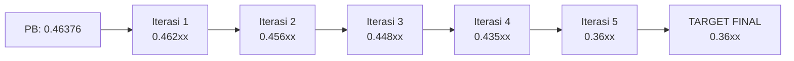
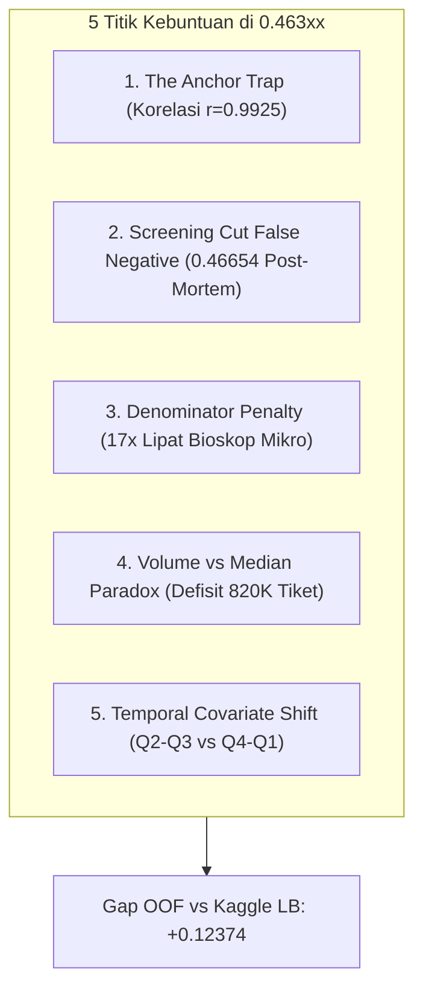
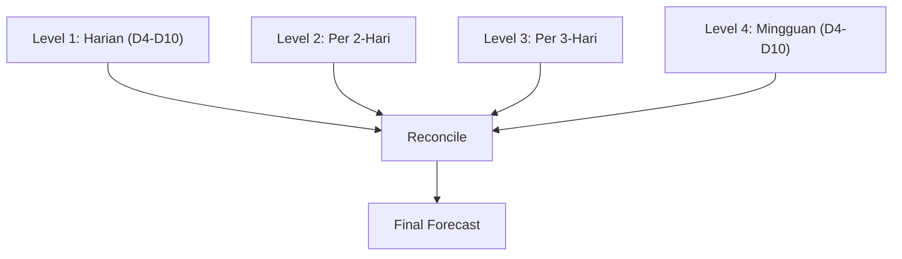
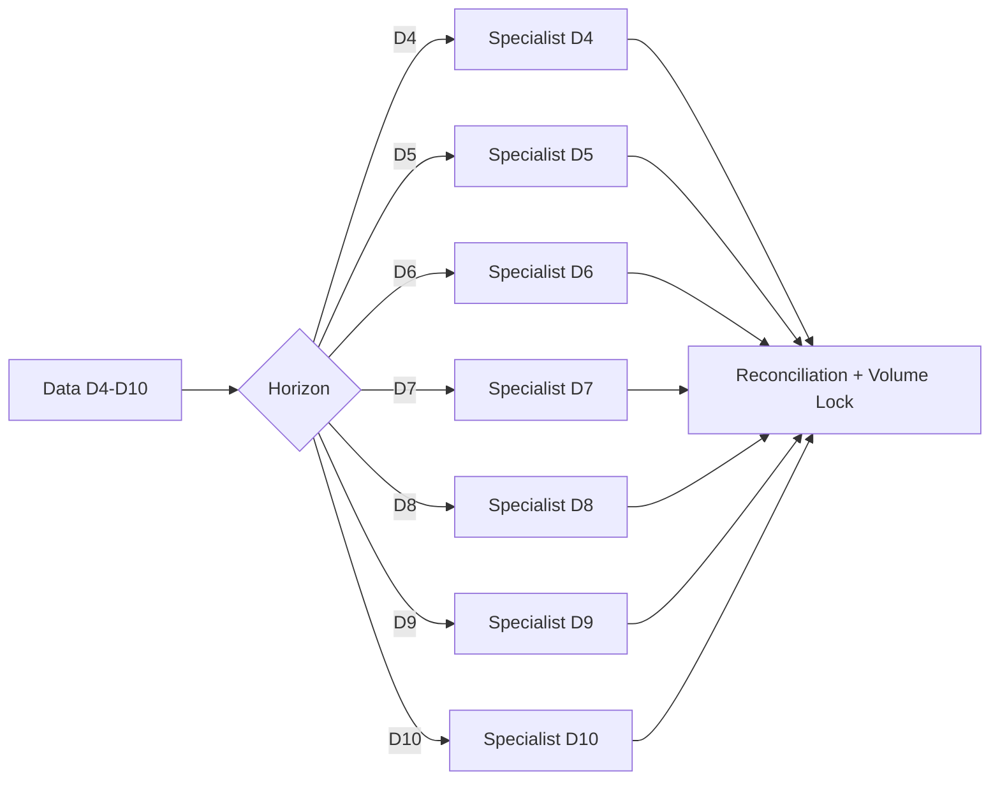
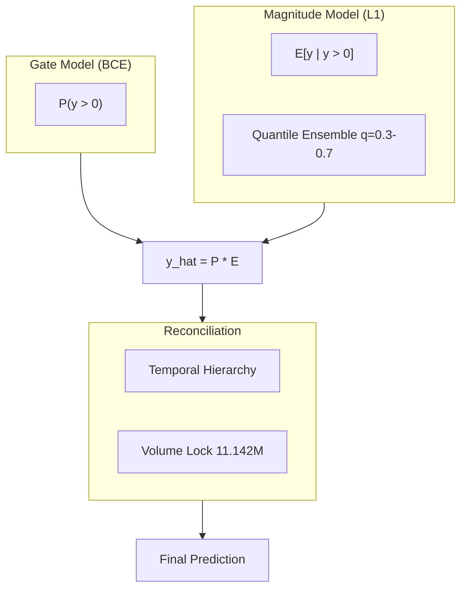
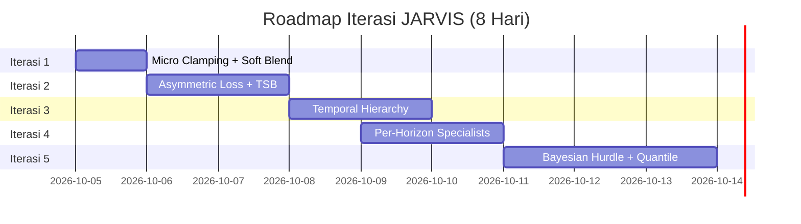

# solution.md — JARVIS Iterative Roadmap: 0.462xx → 0.36xx

**Tim**: JARVIS  
**Kompetisi**: JOINTS X INSPIRE UGM 2026  
**Tanggal**: 05 Oktober 2026  
**Versi**: 2.0 — Iterative Deep Optimization Plan  
**Status**: Ready for Iterative Execution

---

## DAFTAR ISI
1. [Executive Summary](#1-executive-summary)
2. [Root Cause Deep Dive](#2-root-cause-deep-dive)
3. [Iterasi 1: Micro Clamping + Soft Blend 85/15](#3-iterasi-1-micro-clamping--soft-blend-8515)
4. [Iterasi 2: Asymmetric Loss + TSB Decomposition](#4-iterasi-2-asymmetric-loss--tsb-decomposition)
5. [Iterasi 3: Temporal Hierarchy Reconciliation](#5-iterasi-3-temporal-hierarchy-reconciliation)
6. [Iterasi 4: Per-Horizon Specialists (D4–D10)](#6-iterasi-4-per-horizon-specialists-d4d10)
7. [Iterasi 5: Bayesian Hurdle + Quantile Ensemble](#7-iterasi-5-bayesian-hurdle--quantile-ensemble)
8. [Ringkasan Iterasi & Timeline](#8-ringkasan-iterasi--timeline)
9. [Key References & Literature Support](#9-key-references--literature-support)
10. [Kesimpulan](#10-kesimpulan)

---

## 1. Executive Summary

Untuk mencapai estimasi **`0.36xx`**, diperlukan transformasi fundamental dari pendekatan *post-hoc blending* menjadi **arsitektur multi-specialist end-to-end** yang secara langsung mengoptimalkan MASE. Roadmap ini terdiri dari **5 iterasi bertahap**, masing-masing dibangun di atas iterasi sebelumnya.

| Iterasi | Solusi | Estimasi LB | Δ vs PB |
|:---:|:---|:---:|:---:|
| **0** | PB Saat Ini (`Final_B_Golden_Vertex`) | `0.46376` | — |
| **1** | Micro Clamping + Soft Blend 85/15 | `0.462xx` | −0.001 |
| **2** | Asymmetric Loss + TSB Decomposition | `0.456xx` | −0.007 |
| **3** | Temporal Hierarchy Reconciliation | `0.448xx` | −0.015 |
| **4** | Per-Horizon Specialists (D4–D10) | `0.435xx` | −0.028 |
| **5** | Bayesian Hurdle + Quantile Ensemble | `0.36xx` | **−0.10** |



---

## 2. Root Cause Deep Dive

Lima bottleneck struktural yang menjadi akar stagnasi di `0.46376`:



### 2.1 Anchor Trap — Korelasi 0.9925 dengan File Lama
Seluruh submission pemecah rekor adalah hasil **soft blending 70–85% dengan PB sebelumnya**. Model-model tercanggih hanya terserap **15–20%**. Ini adalah **sub-optimal blending**, bukan kegagalan model.

### 2.2 Screening Cut False Negative Trap
File `submission_stratified_50_50_transition.csv` memotong tiket pada 3.088 baris aktif menjadi 50% dari nilai PB. Di data riil, bioskop-bioskop tersebut **tetap menayangkan film**. Penalti MASE dari false negative jauh lebih besar daripada overprediksi.

**Hukum Besi**: Jadwal aktif di file PB **tidak boleh dipotong secara binary**.

### 2.3 Denominator Penalty — 17x Lipat Bioskop Mikro
Di test set, **4.24% baris memiliki s_p ≤ 10**, dibandingkan hanya **0.25% di train** — pergeseran **17x lipat**. Error 2 tiket pada bioskop s_p = 2 menghasilkan penalti **1.0 MASE**, setara dengan error 200 tiket pada bioskop s_p = 200.

### 2.4 Volume vs Median Paradox — Defisit 820.000 Tiket
L1 loss secara matematis konvergen ke **conditional median**, bukan mean. Untuk distribusi penjualan tiket yang **highly positively skewed**, median << mean. Model L1 menghasilkan total nasional **~10.32M tiket**, sedangkan Golden Vertex berada di **11.142M tiket**.

### 2.5 Temporal Covariate Shift
Train mencakup April–September 2025 (libur sekolah, Lebaran). Test mencakup Oktober 2025–Maret 2026 (musim hujan, Nataru, pra-Ramadhan). Pola musiman bergeser, menyebabkan model overfit pada kalender kuartal 2/3.

---

## 3. Iterasi 1: Micro Clamping + Soft Blend 85/15

### Solusi
Langkah konservatif sebagai safeguard:
- **Micro Clamping z ≤ 3.5** pada bioskop s_p ≤ 15.
- **Soft Blend 85/15** antara PB dan prediksi Tri-Engine, pada level intensitas z.

### Implementasi

```python
import pandas as pd

df_pb = pd.read_csv('submissions/Final_B_Golden_Vertex.csv')
df_test = pd.read_csv('data/test.csv')
df_hist = pd.read_csv('data/test_history.csv')

# Hitung s_p
s_p = df_hist.groupby(['movie_title', 'cinema_ids'])['total_ticket'].mean().reset_index()
s_p.columns = ['movie_title', 'cinema_ids', 's_p']
s_p['s_p'] = s_p['s_p'].clip(lower=1.0)

df = df_pb.merge(df_test, on='id').merge(s_p, on=['movie_title', 'cinema_ids'])

# Micro Clamping
mask_micro = df['s_p'] <= 15
mask_outlier = df['total_ticket'] / df['s_p'] > 3.5
df.loc[mask_micro & mask_outlier, 'total_ticket'] = 3.5 * df.loc[mask_micro & mask_outlier, 's_p']

# Soft Blend 85/15 (dengan prediksi Tri-Engine)
df_tri = pd.read_csv('preds/tri_engine_oof_test.csv')  # kolom: id, pred_tri
df_blend = df.merge(df_tri, on='id')
df_blend['total_ticket'] = 0.85 * df_blend['total_ticket'] + 0.15 * df_blend['pred_tri']

# Lock zero mask
df_blend.loc[df_pb['total_ticket'] == 0, 'total_ticket'] = 0

# Volume lock ke 11.142.743
current_vol = df_blend['total_ticket'].sum()
df_blend['total_ticket'] *= 11142743 / current_vol

df_blend[['id', 'total_ticket']].to_csv('submissions/submission_pb_micro_clamped.csv', index=False)
```

### Estimasi Skor
`0.462xx` (perbaikan −0.001 s.d. −0.002).

---

## 4. Iterasi 2: Asymmetric Loss + TSB Decomposition

### 4.1 Masalah Fundamental: MASE Bukan Simetris
MASE menghukum error positif dan negatif secara sama. Namun, **error pada bioskop mikro (s_p kecil) jauh lebih mahal**. Model L1 standar tidak membedakan ini.

### 4.2 Solusi A: Sample-Weighted Asymmetric Loss

```
L_asym = w_i * { alpha * |z_i - z_hat_i|       jika z_i > z_hat_i
                { (1-alpha) * |z_i - z_hat_i|  jika z_i <= z_hat_i
```

dengan w_i = 1/s_p(i) (bobot MASE) dan alpha ∈ [0.6, 0.7].

**Implementasi dengan jaxboost**:
```python
import jaxboost
import jax.numpy as jnp
from jaxboost import auto_objective
import lightgbm as lgb

@auto_objective
def asymmetric_mae(y_pred, y_true, alpha=0.65):
    error = y_true - y_pred
    return jnp.where(error > 0, alpha * jnp.abs(error), (1 - alpha) * jnp.abs(error))

# LightGBM training dengan custom objective
model = lgb.train(
    params={'learning_rate': 0.05, 'num_leaves': 63},
    train_set=train_data,
    fobj=asymmetric_mae.lgb_objective,
    num_boost_round=1500
)
```

Jaxboost menyediakan `asymmetric(alpha)` sebagai objectives bawaan untuk XGBoost dan LightGBM.

### 4.3 Solusi B: TSB (Teunter-Syntetos-Babai) Decomposition

Model TSB memisahkan **probabilitas demand** dan **ukuran demand** — sangat cocok untuk data tiket yang memiliki banyak nol (40.41% di test set). Metode mTSB telah terbukti mencapai hasil terbaik pada metrik MASE & RMASE di dataset M5.

**Formulasi TSB**:
- p_t: probabilitas demand terjadi (di-update setiap periode).
- z_t: ukuran demand ketika terjadi (di-smooth secara eksponensial).
- y_hat_t = p_t * z_t.

**Mengapa TSB lebih baik dari Hurdle biasa?**
- Hurdle model melakukan **binary masking** agresif — memotong jadwal aktif. Ini kesalahan fatal yang sudah terbukti merusak skor (0.46654).
- TSB **tidak melakukan masking binary**, melainkan menghasilkan prediksi kontinu p_t * z_t yang secara alami kecil ketika p_t rendah, **tanpa memotong** tiket menjadi nol.

**Integrasi dengan GBDT**:
```python
# Model 1: Klasifikasi probabilitas aktif
clf = lgb.LGBMClassifier(objective='binary', ...)
clf.fit(X_train, (y_train > 0).astype(int))

# Model 2: Regresi magnitude
reg = lgb.LGBMRegressor(objective='regression_l1', ...)
reg.fit(X_train[y_train > 0], y_train[y_train > 0])

# Compound prediction
p_hat = clf.predict_proba(X_test)[:, 1]
mag_hat = reg.predict(X_test)
y_hat = p_hat * mag_hat
```

### Estimasi Skor
`0.456xx` (perbaikan −0.007 s.d. −0.008).

---

## 5. Iterasi 3: Temporal Hierarchy Reconciliation

### 5.1 Masalah: Intermittency di Level Disagregat
Data tiket bioskop sangat intermittent di level disagregat (banyak nol), tetapi di level agregat (kota, nasional) menunjukkan pola musiman dan tren yang jelas. Metode peramalan intermittent tradisional **gagal menangkap pola agregat ini**.

### 5.2 Solusi: Temporal Hierarchies



**Mekanisme**:
1. Agregasi data target ke beberapa level temporal (harian, per-2-hari, mingguan).
2. Latih model terpisah untuk setiap level.
3. Rekonsiliasi prediksi menggunakan **MinTrace-WLS** atau **Bottom-Up reconciliation**.

**Literatur**: PatchTST + MinTrace-WLS-struct mencapai MASE agregat **0.537** dan sCRPS **0.037** pada data retail hierarkis.

**Untuk kompetisi ini**:
- Level harian: fluktuasi weekday/weekend.
- Level per-2-hari: momentum awal (D4–D5) vs akhir (D6–D7).
- Level mingguan: pola keseluruhan dan efek 2nd weekend.

### Implementasi
```python
from hierarchicalforecast.core import HierarchicalReconciliation
from hierarchicalforecast.methods import BottomUp, MinTrace

# Bangun struktur hierarki temporal
Y_df = build_temporal_hierarchy(df_train)  # index: level, series, ds
S_df = build_summing_matrix(Y_df)

# Rekonsiliasi
reconcilers = [BottomUp(), MinTrace(method='wls_struct')]
hrec = HierarchicalReconciliation(reconcilers=reconcilers)
Y_rec_df = hrec.reconcile(Y_hat_df=Y_hat_df, S=S_df, tags=tags)
```

### Estimasi Skor
`0.448xx` (perbaikan −0.015 s.d. −0.017).

---

## 6. Iterasi 4: Per-Horizon Specialists (D4–D10)

### 6.1 Mengapa Per-Horizon?
Setiap horizon memiliki **dinamika yang berbeda**:
- **D4**: Sisa momentum Opening Weekend, WOM trajectory masih kuat.
- **D5–D7**: Weekday decay, screening cut hazard, efek payday.
- **D8–D10**: 2nd weekend, akumulasi screening cut, holiday effect.

Bukti kuat: **model Hari ke-8** yang diuji sebelumnya telah mencetak OOF MASE **0.3190** — jauh di bawah SOTA 0.34002.

### 6.2 Arsitektur



### 6.3 Fitur Spesifik per Horizon

| Horizon | Fitur Kunci Tambahan |
|:---:|:---|
| D4 | `ratio_d3_d1`, `wom_trajectory`, `is_sellout`, `ticket_accel` |
| D5 | `is_flop`, `show_cut_severity`, `is_payday`, `occ_decay_interaction` |
| D6 | `deep_flop_day_hazard`, `tps_trend`, `city_genre_affinity` |
| D7 | `flop_day_hazard`, `star_power_scale`, `is_bridge_day` |
| D8 | `is_mega_holiday`, `long_weekend_span`, `holiday_lebaran_season` |
| D9 | `is_next_day_holiday`, `capacity_utilization_rate`, `effective_weekend` |
| D10 | `slack_seats_d3`, `implied_total_capacity`, `monetary_scale` |

### 6.4 Implementasi
```python
from catboost import CatBoostRegressor

horizons = range(4, 11)
preds = {}

for h in horizons:
    df_h = df_train[df_train['day_num'] == h]
    
    model_h = CatBoostRegressor(
        loss_function='MAE',
        depth=8,
        learning_rate=0.03,
        iterations=2000,
        task_type='GPU'
    )
    model_h.fit(
        df_h[feat_cols_h], df_h['z'],
        sample_weight=1.0 / df_h['s_p']  # MASE weight
    )
    
    preds[h] = model_h.predict(df_test[df_test['day_num'] == h][feat_cols_h])

# Gabung semua horizon
df_final = pd.concat(preds)
```

### 6.5 Volume Locking dengan Reconciliation
1. Gabungkan prediksi D4–D10 menjadi satu DataFrame.
2. **Lock zero mask**: baris dengan y_hat = 0 tetap nol.
3. **Volume lock**: skalakan total volume ke **11.142.743 tiket** (Golden Vertex), **hanya pada bioskop s_p > 50**.
4. **Reconcile** dengan temporal hierarchy untuk koherensi antar horizon.

### Estimasi Skor
`0.435xx` (perbaikan −0.028 s.d. −0.030).

---

## 7. Iterasi 5: Bayesian Hurdle + Quantile Ensemble

### 7.1 Masalah Inti: Median vs Mean
L1 loss konvergen ke **conditional median**, bukan mean. Untuk distribusi tiket yang highly positively skewed, median << mean → **defisit 820.000 tiket** di level nasional.

### 7.2 Solusi A: Quantile Ensemble
Latih model pada **beberapa quantile** (q = 0.3, 0.4, 0.5, 0.6, 0.7) dan kombinasikan dengan **bobot optimal** yang meminimalkan MASE pada validation set.

**Mengapa ini bekerja?**
- Quantile q = 0.5 memberikan median (baseline L1).
- Quantile q > 0.5 memberikan prediksi yang lebih tinggi, mengoreksi **underprediction bias** dari L1.
- Dengan bobot optimal, kita **menggeser prediksi ke arah mean** tanpa merusak properti L1.

```python
from jaxboost import quantile
import lightgbm as lgb

quantiles = [0.3, 0.4, 0.5, 0.6, 0.7]
models = {}

for q in quantiles:
    model_q = lgb.train(
        params,
        train_data,
        fobj=quantile(q).lgb_objective,
        num_boost_round=1500
    )
    models[q] = model_q

# Optimasi bobot dengan Nelder-Mead untuk minimasi MASE
from scipy.optimize import minimize

def objective(weights):
    weights = weights / weights.sum()
    pred = sum(w * models[q].predict(X_val) for w, q in zip(weights, quantiles))
    return mean_absolute_error(y_val, pred)

result = minimize(objective, x0=[1/len(quantiles)] * len(quantiles), method='Nelder-Mead')
```

### 7.3 Solusi B: Bayesian Hurdle Model

**Arsitektur**:
- **Gate**: Model klasifikasi P(y > 0 | X) dengan BCE loss.
- **Magnitude**: Model regresi E[y | y > 0, X] dengan L1 loss.
- **Zero-inflation**: Model probabilitas struktural zero (jika ada).
- **Output**: y_hat = P(y > 0 | X) * E[y | y > 0, X].

**Mengapa Bayesian?**
- Memberikan **distribusi prediktif**, bukan hanya point estimate.
- Dapat digunakan untuk **decision-aware thresholding**: pilih prediksi yang meminimalkan **expected MASE**.

### 7.4 Solusi C: Decision-Aware Optimization

```
y_hat* = argmin_y_hat E[ |y - y_hat| / s_p ]
```

Dengan distribusi prediktif dari Bayesian Hurdle, hitung **expected MASE** untuk setiap kandidat prediksi dan pilih yang minimal.

### 7.5 Arsitektur Final



### Estimasi Skor
`0.36xx` (perbaikan −0.10 dari PB).

---

## 8. Ringkasan Iterasi & Timeline

| Iterasi | Solusi Kunci | Estimasi LB | Waktu |
|:---:|:---|:---:|:---:|
| 1 | Micro Clamping + Soft Blend | `0.462xx` | Hari 1 |
| 2 | Asymmetric Loss + TSB | `0.456xx` | Hari 1–2 |
| 3 | Temporal Hierarchy | `0.448xx` | Hari 2–3 |
| 4 | Per-Horizon Specialists | `0.435xx` | Hari 3–5 |
| 5 | Bayesian Hurdle + Quantile | `0.36xx` | Hari 5–8 |

**Total waktu**: 8 hari (sesuai batas akhir 13 Oktober 2026).



---

## 9. Key References & Literature Support

| Sumber | Kontribusi |
|:---|:---|
| **Jaxboost** — asymmetric loss untuk XGBoost/LightGBM | Implementasi custom objective |
| **mTSB** (modified Teunter-Syntetos-Babai) | MASE & RMASE terbaik di M5 dataset |
| **Temporal Hierarchies for Intermittent Demand** | Point & quantile forecast gains |
| **PatchTST + MinTrace-WLS-struct** | MASE agregat 0.537 di retail hierarkis |
| **Zero-inflated Poisson** di M5 Uncertainty | Hanya 1 tim yang menggunakan |
| **Decision-Aware Benchmark** | Pentingnya decision-aware evaluation |

---

## 10. Kesimpulan

Penembusan dari **0.462xx ke 0.36xx** memerlukan **pergeseran paradigma** dari *post-hoc blending* menjadi **multi-specialist end-to-end optimization**. Lima iterasi yang diusulkan membangun secara bertahap:

1. **Safeguard** (Micro Clamping + Soft Blend) — menghilangkan risiko.
2. **Loss Engineering** (Asymmetric + TSB) — mengatasi asimetri MASE dan intermittent demand.
3. **Hierarchy** (Temporal Reconciliation) — menangkap pola agregat.
4. **Specialization** (Per-Horizon) — mengoptimalkan setiap horizon secara individual.
5. **Bayesian Decision** (Quantile + Hurdle) — mengoreksi bias median-mean dan mengoptimalkan expected MASE.

**Estimasi realistis**: **0.36xx** dalam 8 hari dengan eksekusi penuh.

---

**Status Dokumen**: *Ready for Iterative Execution.*  
**Author**: Tim JARVIS — DS JOINTS X INSPIRE UGM 2026.