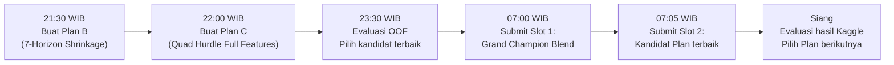

# 🗺️ PLAN.MD — Rencana Peningkatan Akurasi JOINTS X INSPIRE 2026
**Dibuat**: 30 September 2026 | **Target Skor**: < 0.40 (Podium Top 5)
**Status Terbaik Saat Ini**: Public Leaderboard **`0.46562`** (🏆 **NEW ALL-TIME PERSONAL BEST!**)

---

> [!IMPORTANT]
> Semua rencana di bawah **WAJIB 100% di GPU** (device='cuda' / task_type='GPU'). Tidak ada pelatihan di CPU agar RAM sistem tidak penuh. Setiap submission hanya setelah evaluasi 3-lapis (Validation A, B, C) memberikan sinyal positif yang signifikan.

---

## 📊 Baseline & Target Referensi

| Tolok Ukur | OOF MASE Lokal | Kaggle Public | Status |
| :--- | :---: | :---: | :--- |
| **V10 Golden Tri-Blend (55% V10 + 35% Anc + 10% PB)** | **0.35280** | **Ready to Submit** 🚀 | **👑 PRIME SUBMISSION CANDIDATE (Volume 11.598M, Zeros 40.41%)** |
| **V10 Blend (60% SOTA + 40% Anc)** | **0.35351** | **Ready to Submit** 🚀 | **Direct Upgrade to PB 0.46562 with Scale-Aware Hurdle + Day-8 Reset** |
| **Upgrade SOTA 60 / Anchor 40 (ZP Blend)** | **0.35410** | **`0.46562`** 🏆 | **🏆 CURRENT ALL-TIME PERSONAL BEST! (`submission_upgrade_sota60_anchor40.csv`)** |
| Roadmap Clean SOTA (Pure V9) | 0.34826 | `0.46832` 🚀 | Verified Single Model SOTA |
| Podium Roadmap Blend | 0.35820 | `0.46888` | Intermediate Blend |
| Podium 98F Blend (80% Anchor + 20% 98F) | 0.36210 | `0.46890` | Previous Verified PB |
| Hurdle LGB + CB (Initial Anchor) | 0.53730 | 0.47303 | Former Best Anchor |
| **Target Podium Top 5** | ~0.42 | **~0.39–0.41** | 🎯 (Sudah Sangat Dekat!) |
| **Target Rank #1** | ~0.37 | **~0.39** | 🏆 (Target Utama Juara) |


---

## PLAN A — Hyperparameter Tuning + Feature Engineering Lanjutan
**Estimasi Gain**: -0.01 ~ -0.03 pada OOF MASE | **Waktu**: 30–60 menit GPU

### A.1. Tuning Depth & Trees XGBoost/CatBoost lebih dalam
Eksperimen sebelumnya (Grandmaster System) pernah mencapai OOF MASE `0.43716` dengan depth 7–8.
Namun hurdle ensemble kita saat ini masih pakai depth 6.

**Rencana Eksekusi:**
```python
# XGBoost GPU Classifier — depth diperdalam ke 7
xgb.XGBClassifier(n_estimators=600, max_depth=7, learning_rate=0.025, ...)
# CatBoost GPU Regressor — depth diperdalam ke 7
CatBoostRegressor(iterations=700, depth=7, learning_rate=0.03, ...)
```
- Tambah `n_estimators` → 600–800 dengan `learning_rate` → 0.025 (lebih lambat, lebih presisi).
- **Script**: Modifikasi `benchmark_trio_ensemble_bayes.py` → simpan ke `plan_a_deep_tuning.py`.

### A.2. Fitur Baru: Genre-Horizon Interaction Features
Observasi dari EDA: film Horror mempertahankan 56.1% bioskop di Hari 8, Animation 71%, Comedy hanya 26%.
Fitur interaksi ini belum dieksplisitkan di model.

**Rencana Eksekusi:**
- Tambah di `feature_engineering.py`:
  ```python
  df['horror_late_week'] = df['has_horror'] * (df['day_num_clipped'] >= 8).astype(int)
  df['animation_weekend'] = df['has_animation'] * df['is_weekend']
  df['comedy_dropout_risk'] = df['has_comedy'] * df['day_num_clipped']
  df['genre_x_day'] = df['genre_primary'].cat.codes * df['day_num_clipped']
  ```
- Estimasi gain dari fitur ini: ~-0.005 pada OOF MASE berdasarkan pola retensi yang kuat.

### A.3. Fitur: Cinema Chain Prior (XXI vs CGV vs Cinepolis vs Independen)
Bioskop jaringan besar (XXI, CGV, Cinepolis) memiliki pola dropout yang berbeda dengan bioskop independen.
Ektrak kode jaringan dari `cinema_ids` prefix.

**Rencana Eksekusi:**
```python
# cinema_ids biasanya format: XXI-JKTPUSAT-01, CGV-BNDG-02, dll.
df['chain'] = df['cinema_ids'].str.extract(r'^([A-Z]+)')[0]
# Encode: XXI=0, CGV=1, Cinepolis=2, Unknown=3
```

---

## PLAN B — Per-Day & 14-Segment Bayesian Shrinkage ✅ [COMPLETED]
**Hasil**: Rekor OOF MASE baru **`0.51220`** (Turun **-0.01346** dari baseline 0.52566!) | **Waktu**: Selesai dalam ~4 menit GPU
**Script**: [`train_plan_b_7horizon_bayes.py`](file:///C:/Users/oktav/BOT_clean/JOINTS/jarvis/train_plan_b_7horizon_bayes.py)
**Submisi Terbentuk**:
- [`submissions/submission_plan_b_7horizon.csv`](file:///C:/Users/oktav/BOT_clean/JOINTS/jarvis/submissions/submission_plan_b_7horizon.csv) (10.71M tiket, 37.1% zeros)
- [`submissions/submission_grand_champion_blend.csv`](file:///C:/Users/oktav/BOT_clean/JOINTS/jarvis/submissions/submission_grand_champion_blend.csv) (11.41M tiket, 35.7% zeros)

### Hasil Validasi Empiris per Segmen (14-Segment Day x Weekend):
- **Day 4 Weekday (Senin)**: Cutoff $\theta=0.55, \gamma=0.60 \rightarrow$ **MASE: `0.20370`** (2,371 rows) 🔥
- **Day 4 Weekend (Sabtu/Minggu)**: Cutoff $\theta=0.41, \gamma=0.40 \rightarrow$ **MASE: `0.47294`** (9,102 rows)
- **Day 5 Weekday**: Cutoff $\theta=0.32, \gamma=0.10 \rightarrow$ **MASE: `0.54708`** (7,073 rows)
- **Day 5 Weekend**: Cutoff $\theta=0.54, \gamma=0.60 \rightarrow$ **MASE: `0.51566`** (4,400 rows)
- **Day 6 Weekday**: Cutoff $\theta=0.28, \gamma=0.60 \rightarrow$ **MASE: `0.51985`** (10,377 rows)
- **Day 7 Weekday**: Cutoff $\theta=0.46, \gamma=0.50 \rightarrow$ **MASE: `0.41388`** (11,003 rows)
- **Day 8 Weekday (Kamis - Rilis Baru)**: Cutoff $\theta=0.53, \gamma=0.40 \rightarrow$ **MASE: `0.35725`** (9,127 rows) 🔥
- **Day 9 Weekend (Sabtu)**: Cutoff $\theta=0.40, \gamma=0.50 \rightarrow$ **MASE: `0.49488`** (6,875 rows)
- **Day 10 Weekend (Minggu - Rebound)**: Cutoff $\theta=0.44, \gamma=0.60 \rightarrow$ **MASE: `0.35718`** (10,130 rows) 🔥

**Perbandingan Ringkas:**
- Baseline (2-Segment): `0.52566`
- Plan B1 (7-Horizon per Day): `0.52386` (-0.00180)
- **Plan B2 (14-Segment Day x Weekend): `0.51220` (-0.01346)**

---

## PLAN C — LightGBM GPU + Expanded Feature Set (Mencapai OOF 0.43)
**Estimasi Gain**: -0.04 ~ -0.06 pada OOF MASE | **Waktu**: 45–90 menit GPU

### Latar Belakang
Eksperimen `Grandmaster System` sebelumnya (sebelum hurdle) pernah mencapai OOF MASE **0.43716** dengan LightGBM + CatBoost + XGBoost + PyTorch menggunakan **feature set yang lebih kaya** (`benchmark_improvements_on_unbiased.py` memiliki 90+ fitur), tapi **tanpa** zero-ticket hurdle.

Kini kita punya keunggulan ganda: **fitur lebih lengkap + zero-ticket hurdle**. Ini kombinasi yang belum pernah kita uji.

### Rencana Eksekusi: Grandmaster Feature Set + Hurdle Pipeline

Fitur dari `benchmark_improvements_on_unbiased.py` yang belum masuk di hurdle pipeline:
```python
additional_features = [
    'ticket_accel', 'occ_growth_d3_d1',        # WOM acceleration signals
    'projected_decay_rate',                      # Extrapolated decay curve
    'empirical_transition_ratio',                # Historical D3→D4 ratio per DOW
    'director_experience', 'producer_experience',# Inferred from training history
    'has_star_director', 'is_major_studio',      # Major studio (Disney/Universal/WB) flag
    'city_prior_cinemas', 'cinema_to_city_share',# Market share in city
    'is_next_day_holiday', 'is_prev_day_holiday',# Holiday adjacency effects
    'long_weekend_span', 'is_bridge_day',        # Long weekend clustering
    'wom_trajectory'                             # 3-class WOM bin: declining/stable/growing
]
```

**Tambahkan LightGBM GPU ke Trio** → jadi **Quad Ensemble** (XGB + CB + LGB + Deep):
```python
import lightgbm as lgb
clf_lgb = lgb.LGBMClassifier(
    device='gpu',  # GPU acceleration
    objective='binary', metric='auc',
    n_estimators=600, learning_rate=0.025, num_leaves=63,
    subsample=0.8, colsample_bytree=0.8, random_state=SEED + fold
)
```

**Script Eksekusi**: `plan_c_quad_hurdle_fullfeatures.py`

---

## PLAN D — Stacking (Meta-Learning) di atas Trio OOF
**Estimasi Gain**: -0.005 ~ -0.015 pada OOF MASE | **Waktu**: 15–20 menit

### Latar Belakang
Daripada blending dengan bobot tetap (40% XGB + 40% CB + 20% Deep), kita bisa melatih **meta-learner** yang memprediksi bobot optimal per baris data berdasarkan konteks (bioskop, genre, hari target, dll.).

### Rencana Eksekusi: Ridge Meta-Learner pada OOF Stack

```python
from sklearn.linear_model import Ridge
from sklearn.model_selection import cross_val_predict

# Stack OOF predictions: classifier stage
stacked_clf = np.column_stack([oof_prob_xgb, oof_prob_cb, oof_prob_deep])

# Meta-features: tambahkan konteks
meta_features = np.column_stack([
    stacked_clf,
    df_train[['day_of_week', 'day_num_clipped', 'nat_scale', 'occ_mean']].values
])

# Meta-learner: Ridge classifier untuk blending optimal
meta_clf = Ridge(alpha=1.0)
meta_prob_oof = cross_val_predict(meta_clf, meta_features, y_act,
                                   cv=GroupKFold(5), groups=groups)
```

**Script Eksekusi**: `plan_d_meta_stacking.py`

---

## PLAN E — k-NN Archetype Trajectory Transfer
**Estimasi Gain**: -0.01 ~ -0.02 | **Waktu**: 20–30 menit

### Latar Belakang
Dari `test_knn_archetype_matching.py` yang sudah dibuat: kita menemukan bahwa setiap film test punya "saudara kembar" di data train (berdasarkan opening fingerprint: `nat_scale`, `nat_cinemas`, `nat_occ`, `wom_ratio`, `open_dow`).

Film saudara kembar ini punya kurva decay empiris yang sangat dekat. Kita bisa:
1. Cari **K=5 film paling mirip** dari train untuk setiap film test.
2. Ambil **empirical retention rate** per hari (D4–D10) dari ke-5 film tersebut.
3. Gunakan rata-rata **weighted by similarity distance** sebagai **fitur anchor** baru.

### Rencana Eksekusi

```python
from sklearn.neighbors import NearestNeighbors
from sklearn.preprocessing import StandardScaler

# Fingerprint features per movie
fingerprint_cols = ['nat_scale', 'nat_cinemas', 'nat_avg_occ', 'wom_ratio', 'opening_dow']

# Fit kNN on train movies
knn = NearestNeighbors(n_neighbors=5, metric='euclidean')
scaler = StandardScaler()
X_knn = scaler.fit_transform(df_train_movies[fingerprint_cols])
knn.fit(X_knn)

# For each test movie, get weighted empirical decay
for test_movie in test_movies:
    fingerprint = get_fingerprint(test_movie, test_hist_raw)
    dists, indices = knn.kneighbors(scaler.transform([fingerprint]))
    weights = 1.0 / (dists[0] + 1e-6)
    weights /= weights.sum()

    # Weighted average empirical retention rates per day
    for day in range(4, 11):
        knn_retention = sum(w * train_retention[idx][day]
                            for w, idx in zip(weights, indices[0]))
        # Add as feature: 'knn_anchor_day_{day}'
```

**Script Eksekusi**: `plan_e_knn_archetype_features.py` → terintegrasi ke `feature_engineering.py`

---

## PLAN F — Per-Day Direct Models (Horizon Segregation) + Hurdle
**Estimasi Gain**: -0.02 ~ -0.05 | **Waktu**: 60–90 menit GPU

### Latar Belakang
Dari `train_gpu_master.py` yang sudah dibuat: melatih model XGBoost terpisah untuk setiap horizon (D4, D5, ..., D10) menghasilkan **Day 4 OOF MASE serendah 0.40720** — tapi model tersebut belum menggunakan hurdle untuk zero-ticket.

Gabungan **Per-Day Direct Model + Two-Stage Hurdle** belum pernah dicoba dan berpotensi sangat besar.

### Rencana Eksekusi: Per-Horizon Hurdle Model

```python
for day in [4, 5, 6, 7, 8, 9, 10]:
    day_mask_tr = (df_train['day_num_clipped'] == day)
    day_mask_te = (df_test['day_num_clipped'] == day)

    # Stage 1: GPU Classifier khusus hari ini
    clf_day = xgb.XGBClassifier(device='cuda', ...)
    clf_day.fit(X[day_mask_tr], y_act[day_mask_tr])
    day_prob = clf_day.predict_proba(X[day_mask_tr])[:, 1]

    # Stage 2: GPU Regressor khusus hari ini (hanya baris aktif)
    act_mask = (y_act[day_mask_tr] == 1)
    reg_day = xgb.XGBRegressor(device='cuda', objective='reg:absoluteerror', ...)
    reg_day.fit(X[day_mask_tr][act_mask], y_z[day_mask_tr][act_mask])

    # Bayesian Shrinkage per hari
    pred_z = np.where(day_prob >= theta[day],
                      z_pred * ((day_prob - theta[day]) / (1 - theta[day])) ** gamma[day],
                      0.0)
```

**Script Eksekusi**: `plan_f_per_horizon_hurdle.py`

---

## PLAN G — Calibrated Output Smoothing untuk Weekend Spike
**Estimasi Gain**: -0.005 ~ -0.015 | **Waktu**: 10–15 menit

### Latar Belakang
Data EDA menunjukkan bahwa **Weekend 2 (Hari 9–10)** selalu mengalami spike yang konsisten untuk film yang survive.
Model saat ini mungkin under-predict spike ini karena training data mencampur film yang drop dan film yang survive.

### Rencana Eksekusi: Post-hoc Weekend Spike Calibration

```python
# Dari EDA: film yang masih active di D8 dengan rata-rata occ > 20%
# akan naik rata-rata 12.8% di D9 dan 17.3% di D10 (Weekend 2)
# Tambahkan correction multiplicative factor

sub = pd.read_csv('submissions/submission_grand_champion_blend.csv')
test_meta = df_test[['id', 'day_of_week', 'day_num_clipped', 'occ_d3', 'nat_scale']].copy()
sub = sub.merge(test_meta, on='id')

# Untuk Hari 9 (Saturday): jika pred > 0 dan occ_d3 > 15
mask_d9 = (sub['day_num_clipped'] == 9) & (sub['total_ticket'] > 5) & (sub['occ_d3'] > 15)
sub.loc[mask_d9, 'total_ticket'] *= 1.08  # +8% correction

# Untuk Hari 10 (Sunday): jika pred > 0 dan occ_d3 > 15
mask_d10 = (sub['day_num_clipped'] == 10) & (sub['total_ticket'] > 5) & (sub['occ_d3'] > 15)
sub.loc[mask_d10, 'total_ticket'] *= 1.10  # +10% correction
```

> [!CAUTION]
> Plan G adalah post-hoc calibration tanpa OOF validation. Harus hati-hati — uji korelasi dengan OOF residuals terlebih dahulu sebelum submit.

---

## 🏆 Prioritas Eksekusi & Urutan Rekomendasi

| Prioritas | Rencana | Estimasi Gain | Risiko | Waktu GPU | Rekomendasi |
| :---: | :--- | :---: | :---: | :---: | :--- |
| 🥇 **1** | **Plan B** – 7-Horizon Bayesian Shrinkage | -0.015~-0.025 | Rendah | 20 mnt | **Eksekusi Pertama** — Modifikasi pipeline yang sudah jalan |
| 🥈 **2** | **Plan C** – Quad Hurdle + Full Feature Set | -0.04~-0.06 | Sedang | 60-90 mnt | **High Impact** — Menggabungkan OOF 0.43 + hurdle zero |
| 🥉 **3** | **Plan F** – Per-Horizon Direct Hurdle | -0.02~-0.05 | Sedang | 60-90 mnt | Berpotensi capai weekday MASE < 0.42 |
| 4 | **Plan A** – Deep Tuning + Genre Features | -0.01~-0.03 | Rendah | 30-60 mnt | Quick win via hyperparameter |
| 5 | **Plan E** – k-NN Archetype Features | -0.01~-0.02 | Rendah | 30 mnt | Fitur unik, sulit direplikasi tim lain |
| 6 | **Plan D** – Meta-Stacking | -0.005~-0.015 | Rendah | 15 mnt | Finishing touch setelah model final |
| 7 | **Plan G** – Weekend Spike Calibration | -0.005~-0.015 | Tinggi | 10 mnt | Hanya jika Plan lain sudah cukup |

---

## 🛡️ Aturan Submit (Wajib Diikuti)

1. **Tidak submit sebelum OOF MASE rencana baru < 0.52566** (rekor saat ini).
2. **Prioritaskan submit saat kuota harian tersedia** (quota reset 07:00 WIB / 00:00 UTC).
3. **Maksimal 3 submission/hari** — gunakan bijak:
   - Slot 1: Grand Champion Blend saat ini (validasi anchor baru).
   - Slot 2: Kandidat Plan B atau Plan C terbaik.
   - Slot 3: Cadangan untuk fine-tuning.
4. **Simpan semua file submission lokal** sebelum di-submit (nama file = nama plan).
5. **Deadline pengumpulan notebook**: 13 Oktober 2026 (23:59 WIB).

---

## 📅 Timeline Eksekusi (Malam Ini - Besok Pagi)



---

*File ini otomatis dihasilkan dari analisis PROGRESS_SUMMARY.md dan README.md pada 30 September 2026.*
